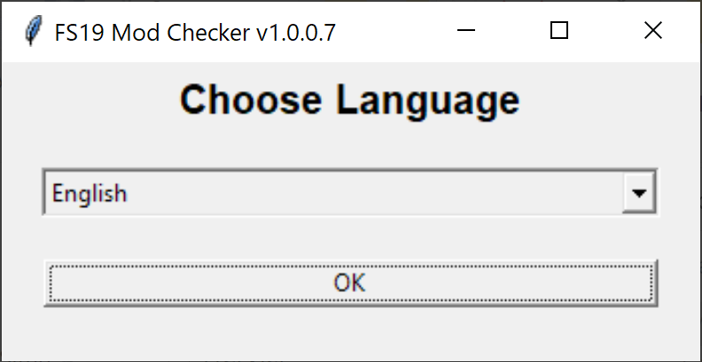
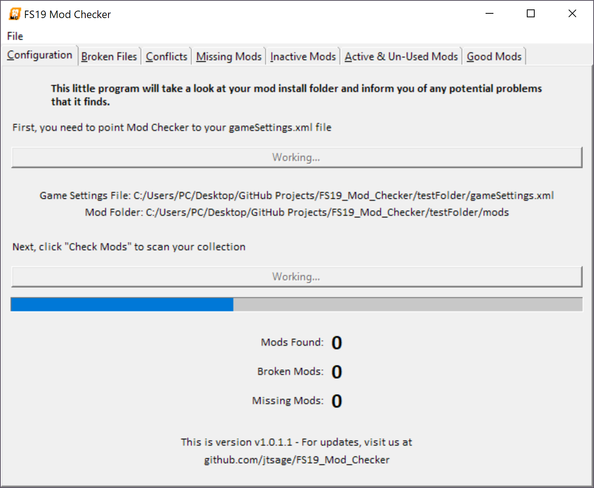
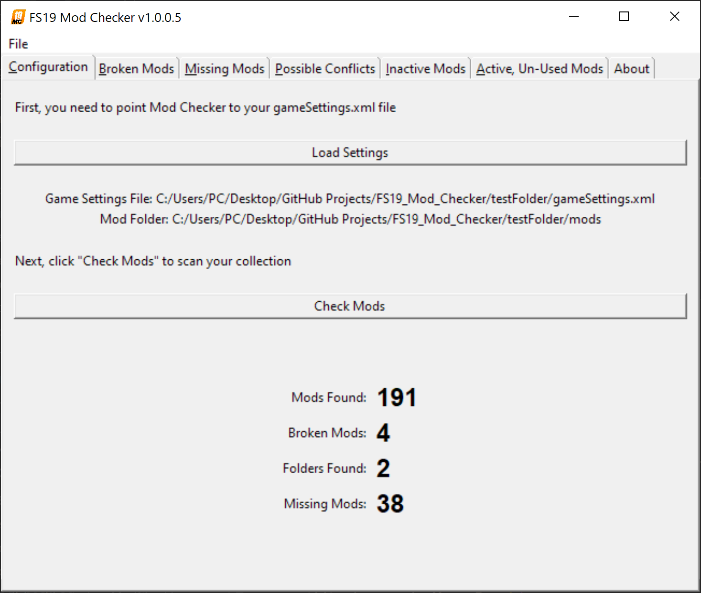
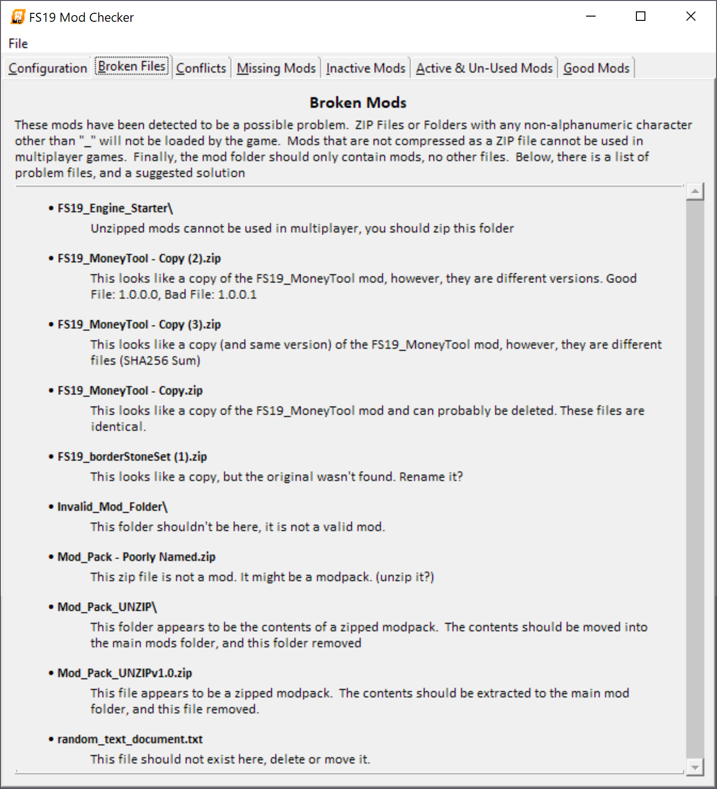
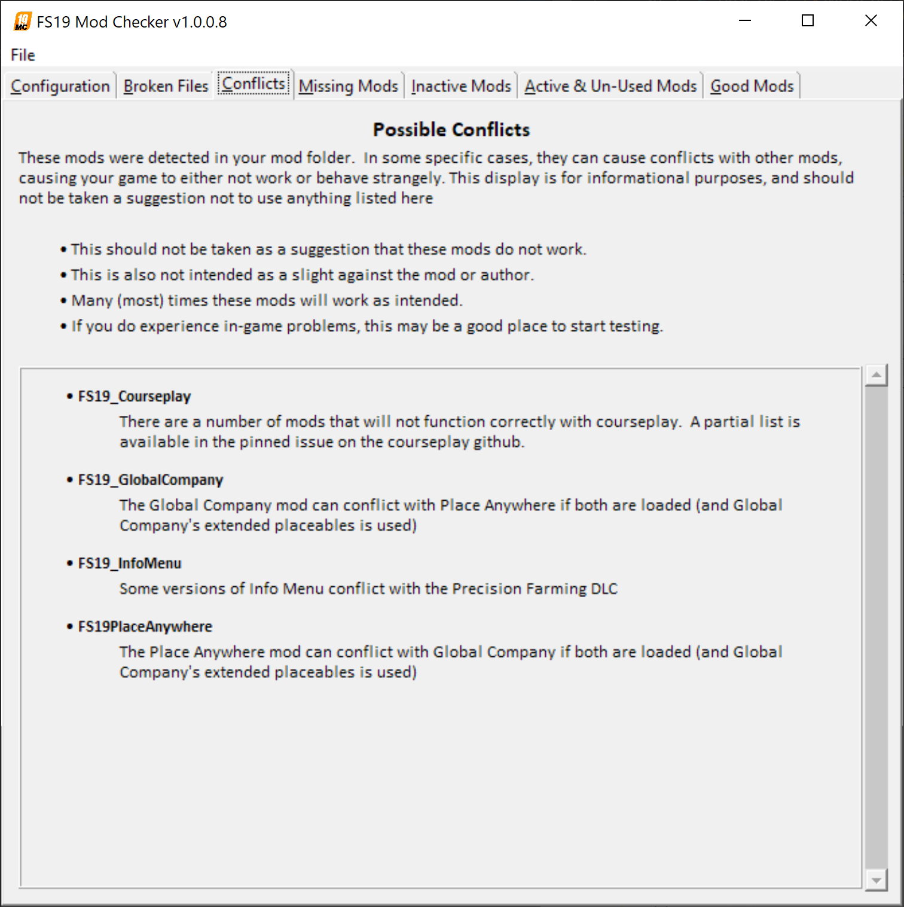
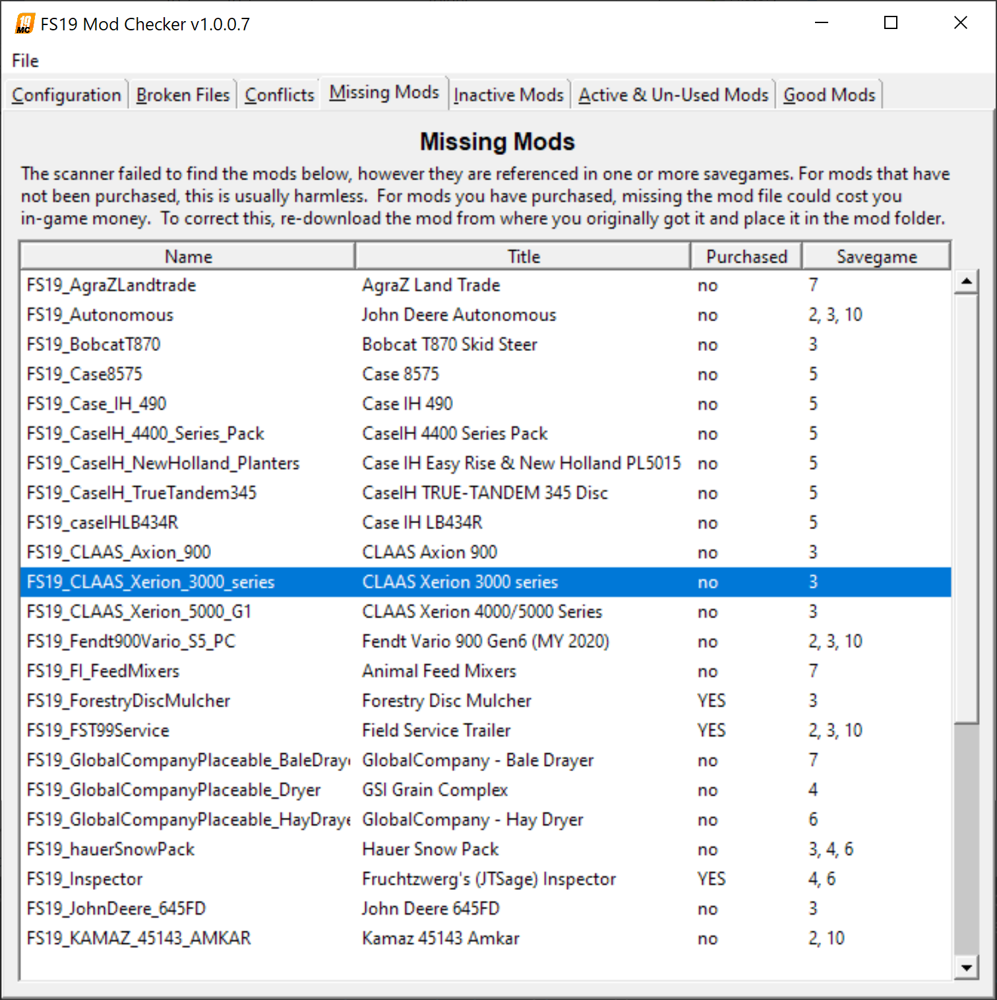
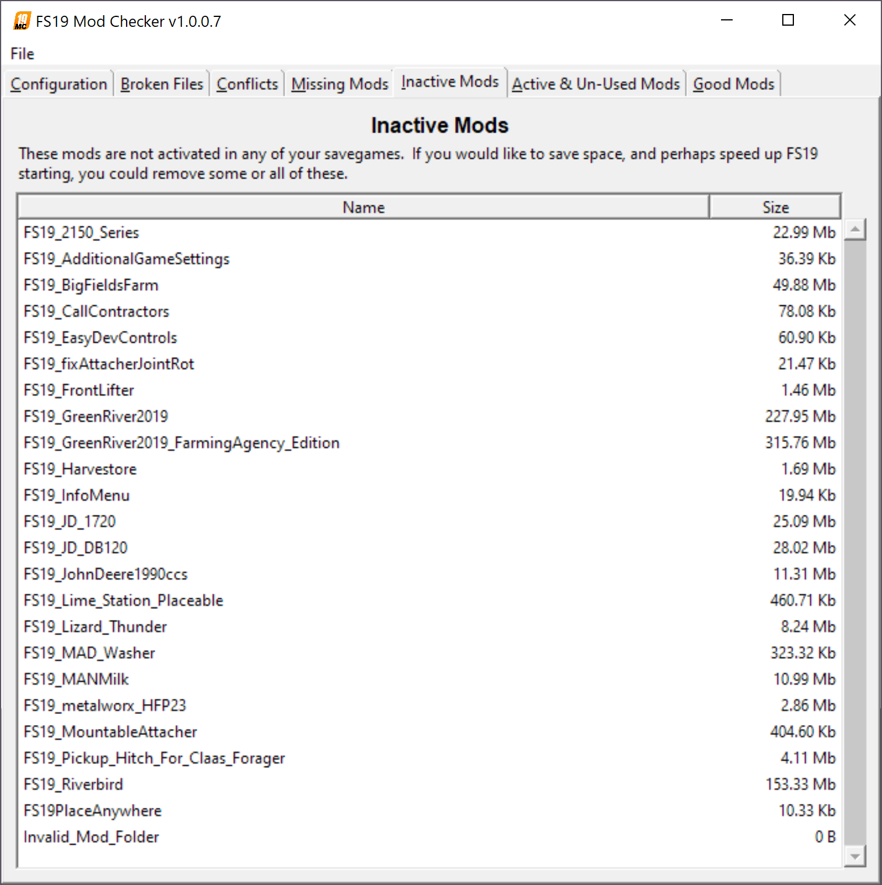
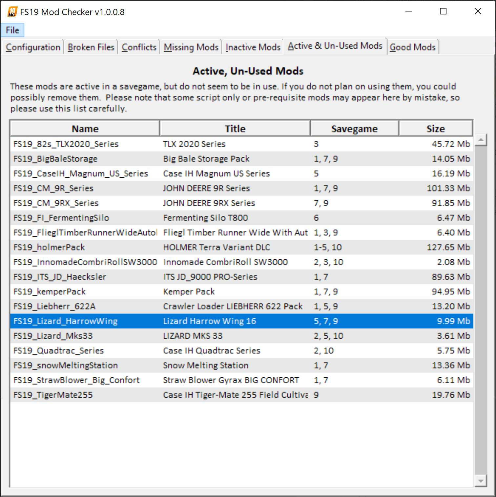
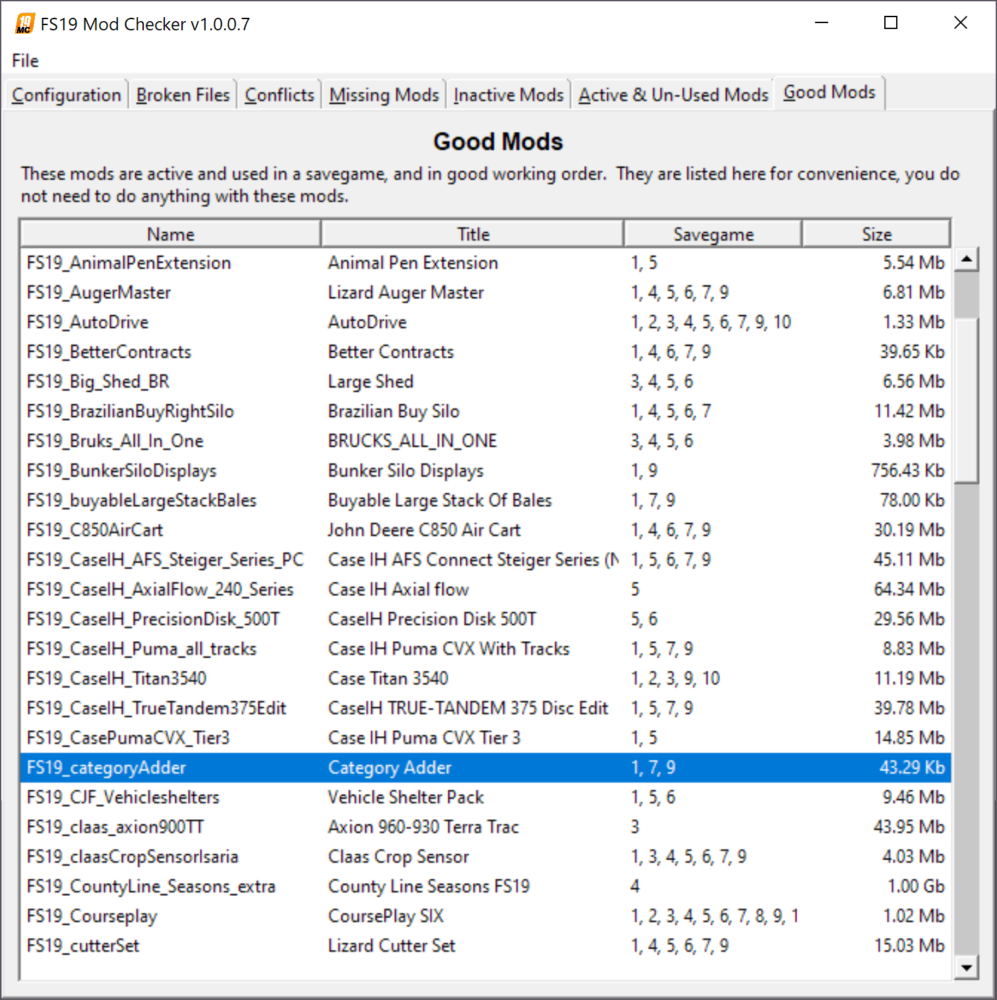
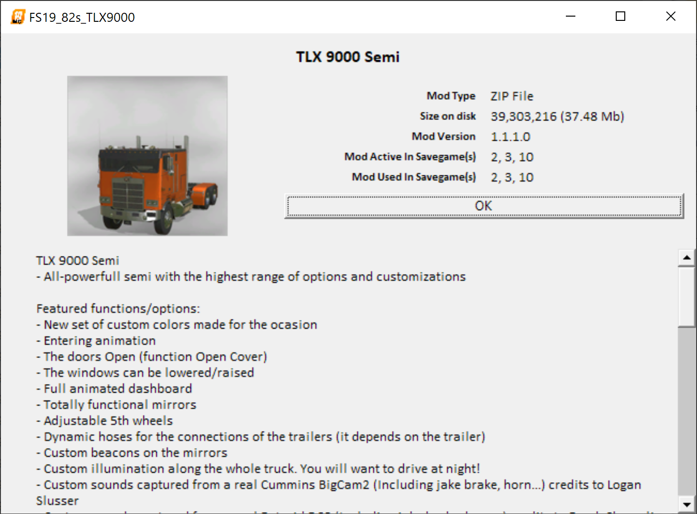

# FS19 Mod Install Checker

[Demo Video](https://streamable.com/wi4u04)

This little program will take a look at your mod install folder and inform you of the following

* If a mod file is named incorrectly and won't load in the game.
  * Suggest it might be a copy if the name looks like a copy
    * Note if you already have that identical file
    * Note if you already have that version, but the files are different
    * Note if you don't have a properly named original
  * Suggest you extract it if it looks like a collection of mods

* If a mod is not properly zipped.
  * Suggest that you zip it up
  * Suggest you move the contents of the folder if it looks like a mod pack
  * Suggest you remove the folder if it looks like garbage

* If a file exists that is not a mod at all
  * Suggest you remove the file

* If a mod is used in your save games, but does not appear to be installed.

* If a mod is not loaded or used in any of your save games

* If a mod is loaded but unused in your save games.

* If a mod you have possibly conflicts with another mod you have.

## What this does

This program provides information only.

### This does not alter or delete any files on your computer at all

You can, optionally, choose to save a log file from the File menu.

## Usage

Run dist/FS19_Mod_Checker.exe - command line or explorer.

## What it looks like

### Language Choice Screen

### Configuration Screen, Mods Loading

### Configuration Screen, Mods Loaded

### Bad Mods, Unzipped Mods, Extra Files

### Possible Conflicts

### Missing Mods

### Inactive, Unused Mods

### Active but Unused Mods

### Good Mods

### Detail Popup

## Development Requirements

* [lxml](https://lxml.de/installation.html) module installed
* [Pillow](https://pillow.readthedocs.io/en/latest/installation.html) module installed

## Translation Effort

Sadly, the primary developer only understands English.  If you'd like to contribute a translation, and already know how gettext .pot/.po files work, check out the locale folder.  If not, you may find a web interface simpler: [Crowdin Project Page](https://crowdin.com/project/fs19-mod-checker)

## In-Progress Improvements

* Create a short list of popular script-only mods and hide them from the "loaded but not used" list. (i.e. AutoDrive, Global Company, Course Play, etc.) [GitHub Issue #4](https://github.com/jtsage/FS19_Mod_Checker/issues/4)

* Note some of the more popular mod conflicts and suggest avoiding them: [GitHub Issue #2](https://github.com/jtsage/FS19_Mod_Checker/issues/2)

## A short note about the EXE

 So, the EXE file (the preferred method of running this) is essentially a miniaturized copy of python with all of the required libraries.  It has been reported in the past that EXE files built with this fantastic package can occasionally cause false positives in virus software.  As of this writing, it looks like it is all good - but that could potentially change for the worst.  As always, the source code is available to peruse at your leisure or run directly. (For the python initiated, this uses auto-py-to-exe to build, the configuration json file is included - of course you will need to update paths to build yourself)
