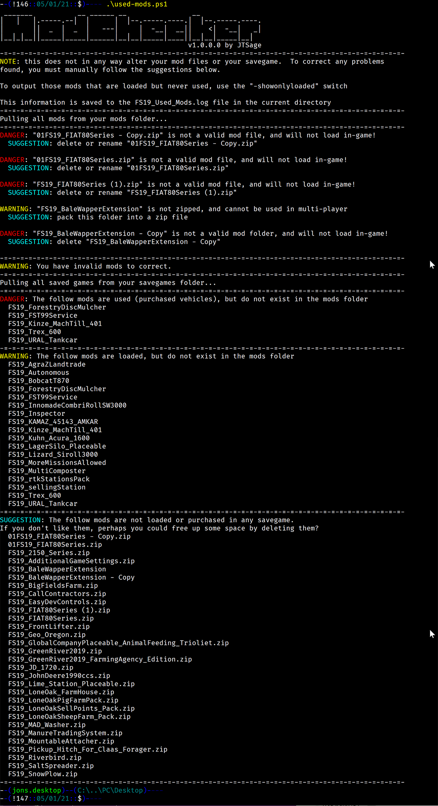

# FS19 Mod Install Checker

This little script will take a look at your mod install folder and inform you of the following

 * If a mod file is named incorrectly and won't load in the game.
   * Script checks for the properly named one, and suggests you rename or delete the file.

 * If a mod is not properly zipped.
   * Script Suggests that you zip it properly

 * If a mod is used in your save games, but does not appear to be installed.
   * Script warns for active but un-used, and warns strenuously for active and used mods.

 * If a mod is not loaded or used in any of your save games
   * Script suggests you could delete it to save space

 * OPTION: If a mod is loaded but unused in your save games.
   * Script suggests you could remove it if you don't plan on using it.

 ## Usage:

 From the command line, execute the script

 ```
 C:\ > .\FS19_Mod_Checker.ps1
 ```

## Output

The output is both shown in the terminal, and saved to a log file in the same folder, ```FS19_Used_Mods_Log.txt```

## What this does

This script provides information only. 

__This does not alter or delete any files on your computer at all__ _(except for adding it's own log file)_

## Options

```
ModChecker v1.0.0.0
-------------------
Usage:
 -savepath [Path to Save Files]  : Set path to save files
 -saveslot [1-20]                : Look at a single save game, by slot number
 -showonlyload                   : Show mods that are active but potentially unused
 -nolog                          : Do not write log file
 -quiet                          : Do not print output to terminal
 -help                           : Print this screen
```

 * ```savepath```
   * If your save game files are not in the standard (steam) location, you can specify that here.  This should point to the folder that contains ```gameSettings.xml``` and ```savegame1``` - ```savegame20```

 * ```saveslot```
   * You can specify the numeric save slot you wish to look at [1-20], otherwise, all slots will be scanned.

 * ```showonlyload```
   * This switch will show mods that are loaded (active) in your save game but do not appear to be used.  Note that there will be a bunch of false positives in this list - any script only mod, or vehicle add on, or pre-requisite script for another mod may appear on this list.  Be careful with what you remove.  Some script only mods have been added to the checker to cut down on false positives.

 * ```nolog```
   * Prevent the script from writing a log file, display only on the screen

 * ```quiet```
   * Prevent the script from outputting to the terminal, only write the log file

 * ```help```
   * Display script usage

## Requirements

Windows powershell.  Sorry Mac users, maybe someday.

## Sample output

 * [Log file with bad mods](FS19_Sample_Log.txt)
   * This log shows a mod folder with misnamed mods in it, along with some "extra" files

 * [Log file with no bad mods](FS19_Sample_Log_Clean.txt)
   * This log shows a mod folder with no misnamed mods, no extracted folders, and no "extra" files

 * Both log files were generated with the ```showonlyload``` option, and both contain "missing" mods.





## Planned Improvements

 * Better suggestions for renaming/deleting bad mods based off of other files in folder. ___(Started)___

 * Create a short list of popular script-only mods and hide them from the "loaded but not used" list. (i.e. AutoDrive, Global Company, Courseplay, etc.) [GitHub Issue #4](https://github.com/jtsage/FS19_Mod_Checker/issues/4)

 * Note some of the more popular mod conflicts and suggest avoiding them: [GitHub Issue #2](https://github.com/jtsage/FS19_Mod_Checker/issues/2)