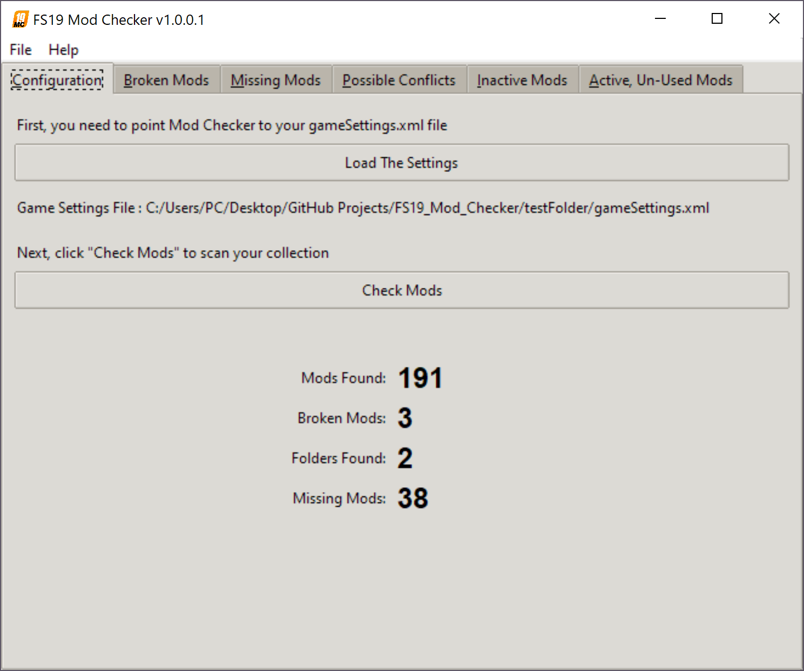
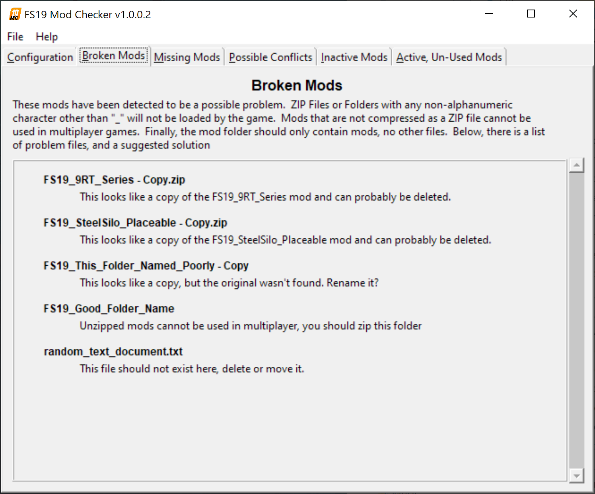
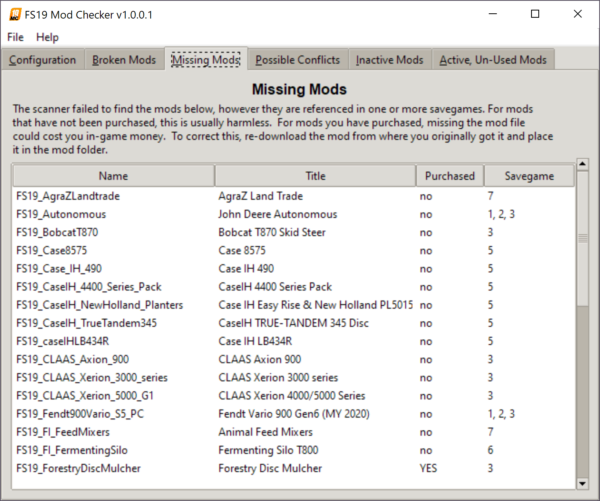
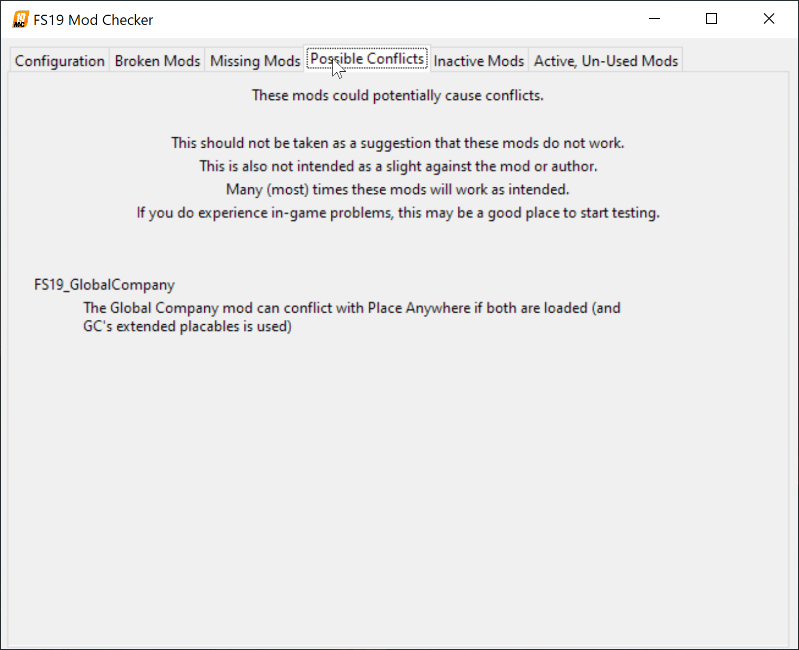
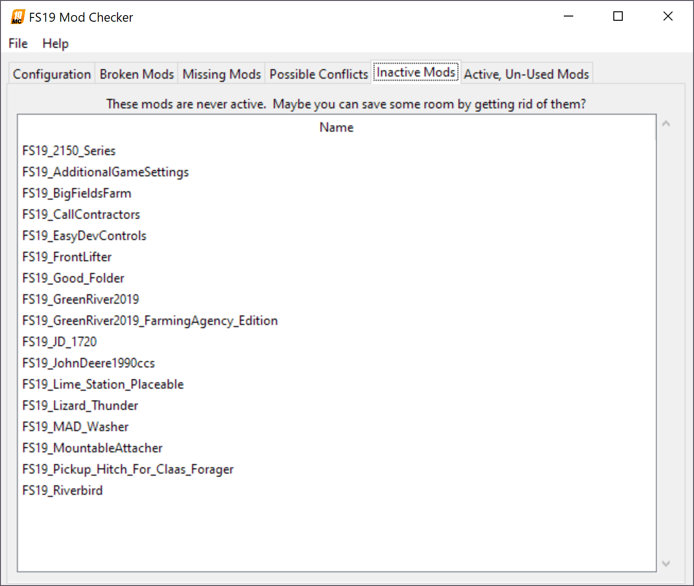

# FS19 Mod Install Checker

This little program will take a look at your mod install folder and inform you of the following

 * If a mod file is named incorrectly and won't load in the game.

 * If a mod is not properly zipped.

 * If a mod is used in your save games, but does not appear to be installed.

 * If a mod is not loaded or used in any of your save games

 * If a mod is loaded but unused in your save games.

## What this does

This program provides information only. 

__This does not alter or delete any files on your computer at all__

## Usage:

Coming soon, hopeing for an executable

## What it looks like

### Configuration Screen, Mods Loaded
{:width="1400px"}

### Bad Mods, Unzipped Mods, Extra Files
{:width="1400px"}

### Missing Mods
{:width="1400px"}

### Possible Conflicts
{:width="1400px"}

### Inactive, Unused Mods
{:width="1400px"}

### Active but Unused Mods
{:width="1400px"}


## Development Requirments

Needs ```lxml```


## Planned Improvements

 * Better suggestions for renaming/deleting bad mods based off of other files in folder. ___(Started)___

 * Create a short list of popular script-only mods and hide them from the "loaded but not used" list. (i.e. AutoDrive, Global Company, Courseplay, etc.) [GitHub Issue #4](https://github.com/jtsage/FS19_Mod_Checker/issues/4)

 * Note some of the more popular mod conflicts and suggest avoiding them: [GitHub Issue #2](https://github.com/jtsage/FS19_Mod_Checker/issues/2)