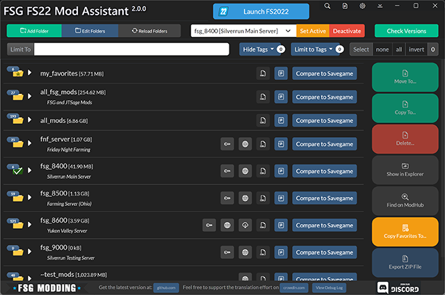

# FSG Mod Assistant

    

___This is a mod folder switcher with extra tools___

- Check mods to ensure that they (probably) work in game
- Check a collection against a save game to see what is used and what is not
- Resolve version differences of mods between collections

__NOTE:__ This will only run under Windows 10 or 11 - If you are still using Windows 7/8/8.1, you really should fix that, but in the meantime, you can run the last version that was supported, [v2.1.4](https://github.com/FSGModding/FSG_Mod_Assistant/releases/tag/v2.1.4)

[Full Documentation Site](https://fsgmodding.github.io/FSG_Mod_Assistant/)

## What this does

At it's core functionality, this is a file manager, and it has the ability to edit FS22's `gameSettings.xml` file to set one of your mod collections as the mod location the game reads.

## At A Glance

## What is a Broken Mod?

- If a mod file is named incorrectly and won't load in the game.
  - Suggest it might be a copy if the name looks like a copy
    - and what the name probably should be
  - Suggest you extract it if it looks like a collection of mods

- If a mod is not properly zipped.
  - Suggest that you zip it up
  - Suggest you move the contents of the folder if it looks like a mod pack
  - Suggest you remove the folder if it looks like garbage

- If a mod is not intended for FS22 (e.g. FS19 & FS17 mods)
  - Warn that you can't use it with this version

- If a file exists that is not a mod at all
  - Suggest you remove the file

## Usage

Download the installer for your platform from the [Releases](https://github.com//FSGModding/FSG_Mod_Assistant/releases) page - the program will install with 1-click, and auto-run when it's ready.

### Download options

Builds are available for the following:

[Latest Release](https://github.com/FSGModding/FSG_Mod_Assistant/releases/latest)

- __win x64 Installer__ : with auto updating
- __win x64 Portable__ : no need to install, but no auto updating

### Install Video

### Updating

Either download the new version and install over top, or, the program will self-update itself every time you start it (downloads silently, installs on demand or at exit)

## Translations and Localizations

Some effort has been made to produce a version of Mod Assistant in your preferred language, but as the creators only speak english, we need help on this.  We accept we have an active [CrowdIn](https://crowdin.com/project/fsg-mod-assistant) project
