# FSG Mod Assistant

    

This is a mod folder switcher with extra tools

- Check mods to ensure that they (probably) work in game
- Check a collection against a save game to see what is used and what is not
- Resolve version differences of mods between collections

___Contents___

- [FSG Mod Assistant](#fsg-mod-assistant)
  - [What this does](#what-this-does)
  - [What is a Broken Mod?](#what-is-a-broken-mod)
  - [Usage](#usage)
    - [Download options](#download-options)
    - [Updating](#updating)
  - [How to Use](#how-to-use)
    - [Main Screen](#main-screen)
      - [Collections Buttons](#collections-buttons)
      - [gameSettings Buttons](#gamesettings-buttons)
      - [Collections Area](#collections-area)
        - [Color Coding and Badges](#color-coding-and-badges)
        - [Active List](#active-list)
        - [Action Buttons](#action-buttons)
        - [Search Feature](#search-feature)
    - [Detail Window](#detail-window)
    - [Move and Copy](#move-and-copy)
    - [Delete](#delete)
    - [Savegame Compare](#savegame-compare)
      - [Badges Used](#badges-used)
    - [Version Check](#version-check)
    - [Edit Folders](#edit-folders)
    - [User Preferences](#user-preferences)
      - [gameSettings.xml](#gamesettingsxml)
      - [Mod Cache](#mod-cache)
  - [Tips and Tricks](#tips-and-tricks)
  - [Something didn't work?!?](#something-didnt-work)
  - [Technical Details](#technical-details)
    - [The Mod Cache](#the-mod-cache)

## What this does

At it's core functionality, this is a file manager, and it has the ability to edit FS22's `gameSettings.xml` file to set one of your mod collections as the mod location the game reads. __For the security conscious__, it's sole communication with the internet is the self-updater for the program, and pulling a list of modHub mods from a server - all of your mods are tested locally - if you prefer to update manually, you can safely block this app in your firewall - although that will break the "Open on ModHub" button. There is also a portable (no-install) version if you prefer that.

## What is a Broken Mod?

- If a mod file is named incorrectly and won't load in the game.
  - Suggest it might be a copy if the name looks like a copy (and what the name probably should be)
  - Suggest you extract it if it looks like a collection of mods

- If a mod is not properly zipped.
  - Suggest that you zip it up
  - Suggest you move the contents of the folder if it looks like a mod pack
  - Suggest you remove the folder if it looks like garbage

- If a mod is not intended for FS22 (e.g. FS19 & FS17 mods)
  - Warn that you can't use it with this version

- If a file exists that is not a mod at all
  - Suggest you remove the file

## Usage

Download the installer for your platform from the [Releases](https://github.com//FSGModding/FSG_Mod_Assistant/releases) page - the program will install with 1-click, and auto-run when it's ready.

### Download options

Builds are available for the following:

- win x64 Installer
- win x64 portable (no need to install)

Linux and Mac: this might build under MacOS and Linux, however I lack a test machine for either, so at a minimum the assumed paths are going to be wrong. If another developer wants to track down the right paths, I'd be happy to add them.

### Updating

Either download the new version and install over top, or, the program will self-update itself every time you start it (downloads silently, installs on exit)

## How to Use

__PLEASE READ: Note about the Mod Cache:__ Mods are scanned and cached from disk so that this app can run as fast as possible - but the initial scanning process is in depth, and ___not very fast___.  So, be aware than when you add a folder of a lot of mods, it may take a bit of time to scan them for the first time. Mod Assistant goes out of it's way to only scan a "version" of a file once, so subsequent loads on the program will be much, much fast.  If you are interested in the details of the cache, see below.

### Main Screen

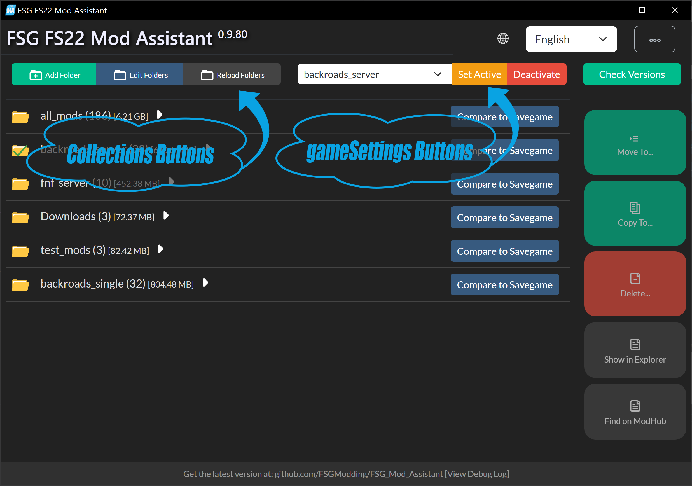

#### Collections Buttons

- __Add Folder__ : This button allows you to add a folder of mods as a collection to the program
- __Edit Folders__ : This button brings up a dialog where you can remove or open your collection folders in windows explorer.
- __Reload Folders__ : This button reloads the contents of your folders.  If you have added or moved mods manually, this button lets you tell FSG Mod Assistant to update it's internal list.  This happens automatically on startup

#### gameSettings Buttons

- __Collection Dropdown__ : Select the collection to activate.  When "--disabled--" is shown, the mod folder override in `gameSettings.xml` is turned off.  When "--unknown--" is shown, the mod folder override is set to a folder that FSG Mod Assistant is not tracking
- __Set Active__ : Set the currently selected collection in the dropdown to be the active collection in Farm Sim. Doing this with the game open could lead to odd results. (It may corrupt your gameSettings file, but most probably it just won't work until you restart the game)
- __Deactivate__ : Set the override in `gameSettings.xml` to off and just use the default mods folder again.

#### Collections Area

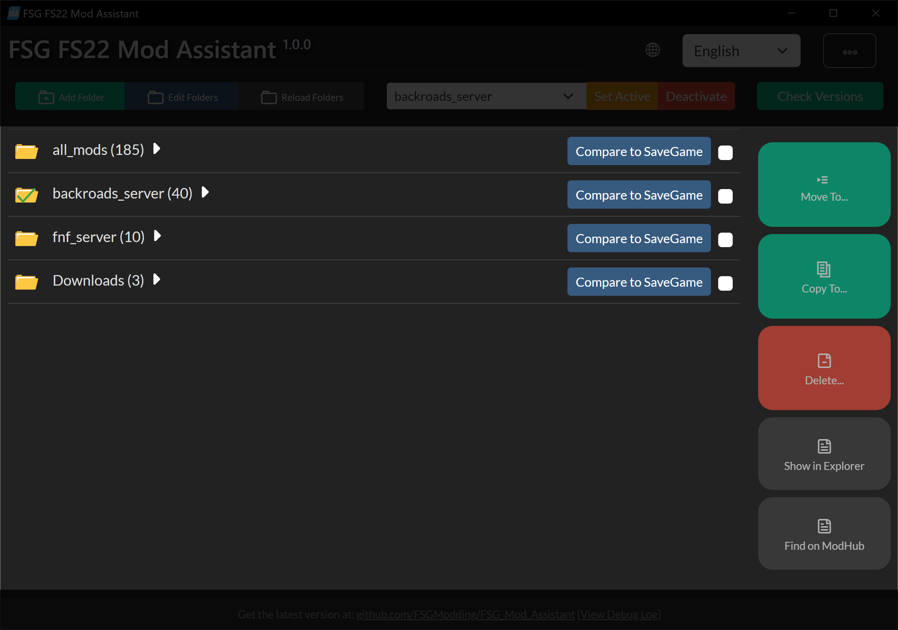
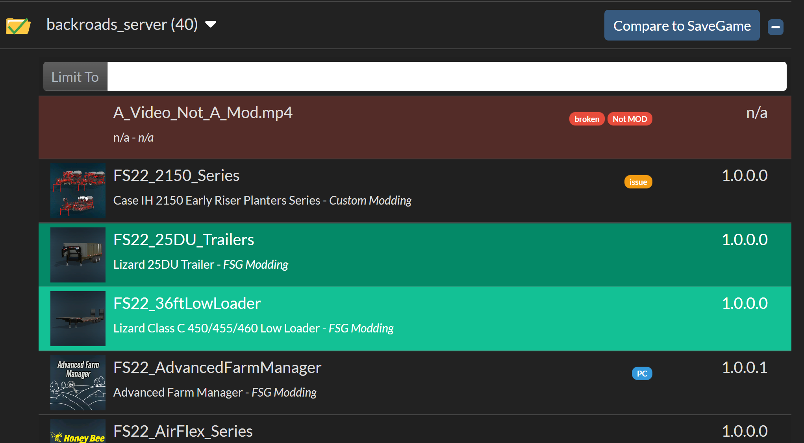

In this area you will see a list of all of the collections (folders) that you have added.

##### Color Coding and Badges

- Colors
  - __Red Background__ : A red background indicates a mod or file that Mod Assistant thinks will not work in game
  - __Green Background__ : This mod is currently selected
- Badges
  - __Update__ : The version of the mod you have does not match the version on modhub
  - __New__ : This file has been added to this collection since the last scan
  - __Recent__ : This mod has recently been updated or released on the modHub
  - __NotMOD__ : This file is not a mod
  - __Broken__ : This mod is likely broken
  - __Issue__ : This mod may have non game breaking issues
  - __noMP__ : This mod can't be used for multiplayer
  - __Folder__ : This mod is unzipped
  - __PC Badge__ : This mod contains scripts, and will only work on PC/Mac

##### Active List

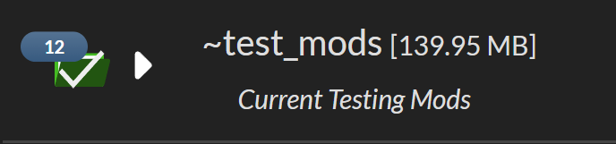

The active list is marked with a green check over the folder.

##### Action Buttons

- __Collection Checkbox__ : You can use this checkbox to quick select all or none of the mods in the list.  Additionally, shift-select for a range of mods is available.
- __Compare to SaveGame__ : This will prompt you for a savegame (folder or zip file) and will compare what mods the save game expects to the mods in the collection.
- __Move To...__ : This will prompt you which collection you wish to move the selected files into. This button is only available when a one or more files are selected.
- __Copy To...__ : This will prompt you which collection you wish to copy the selected files into. This button is only available when a one or more files are selected.
- __Delete__ : This will prompt you to make sure you wish to delete the selected files. This button is only available when a one or more files are selected.
- __Show in Explorer__ : Open a windows explorer window with the selected file pre-selected. This button is only available when a single file is selected.
- __Find on ModHub__ : Attempt to open this mod on the modhub. This button is only available when a single file is selected, and Mod Assistant knows it is on the modhub. The list of mods is updated roughly hourly, and is refreshed when you restart the app.

##### Search Feature

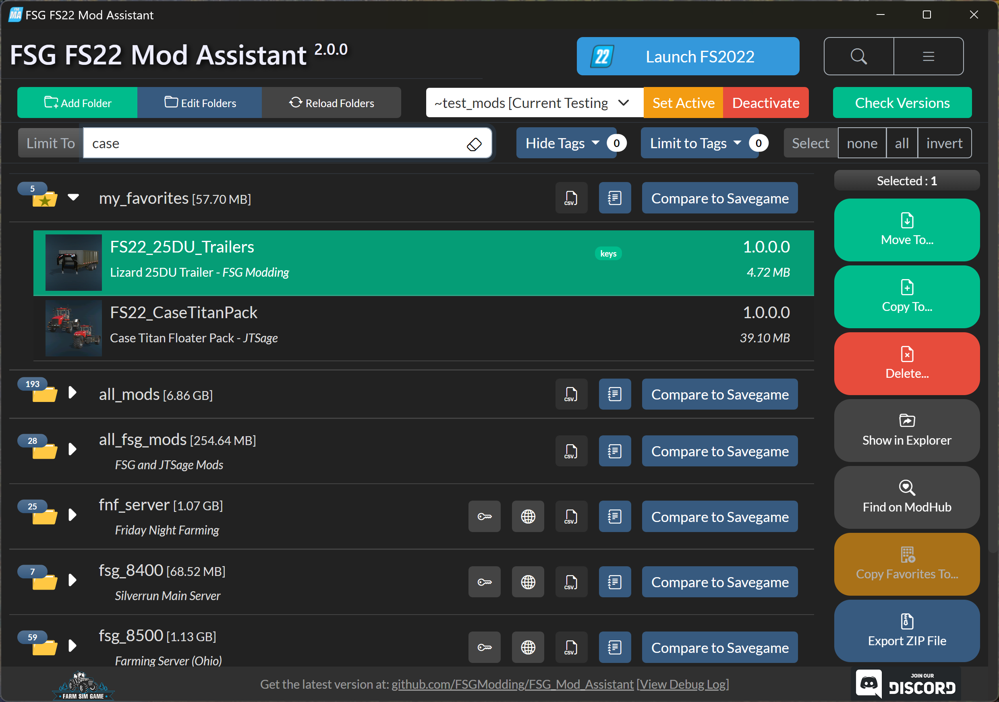

This allows you to refine which parts of the collection you see.  This is a simple full text search, however preceding the search string with `!` will show mods that do _not_ match the string.  In this example, `FS22_25DU_Trailers` is still shown, even though it does not match the string, because it was selected prior to searching.  This is a safety measure so you do not accidentally move, copy, or delete files you were not intending to.

The `Show Non-Mods` button will hide files that Mod Assistant thinks are not mods, and the `Show Broken` button will hide mods that Mod Assistant believes are broken

### Detail Window

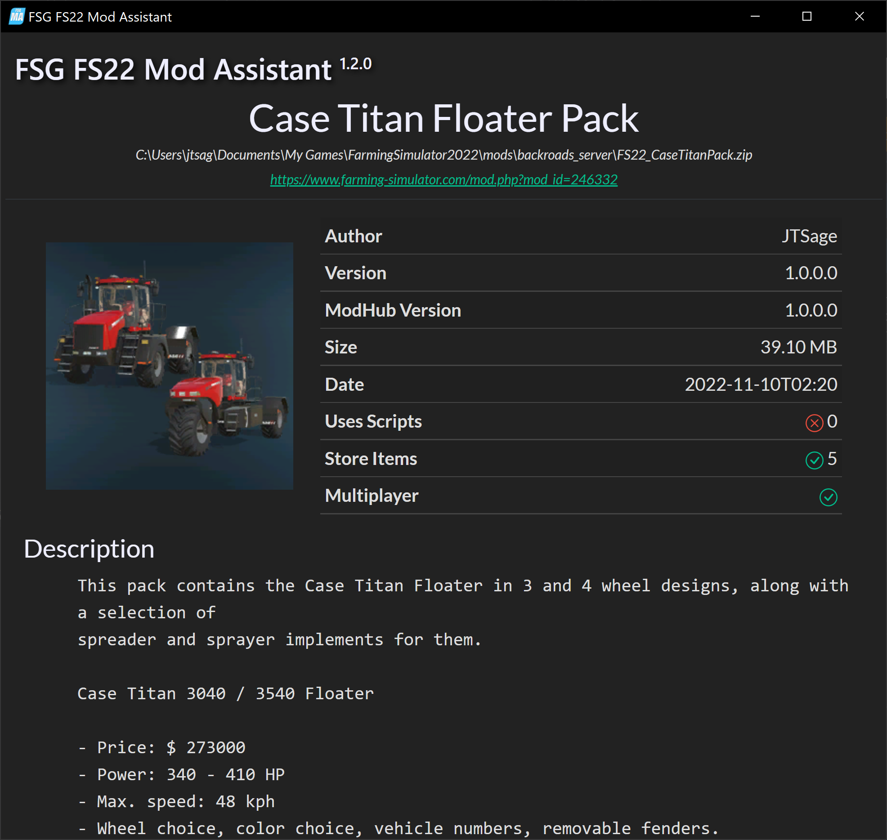

Double clicking or right clicking on a mod in the main window will bring up the detail window where you can see details about the mod such as the file date, file size, if it uses scripts, how many store items it has, and the mod description.

If problems or issues were found with the mod, you will also be presenting with detailed information on the issue, often with suggestions of how to fix them

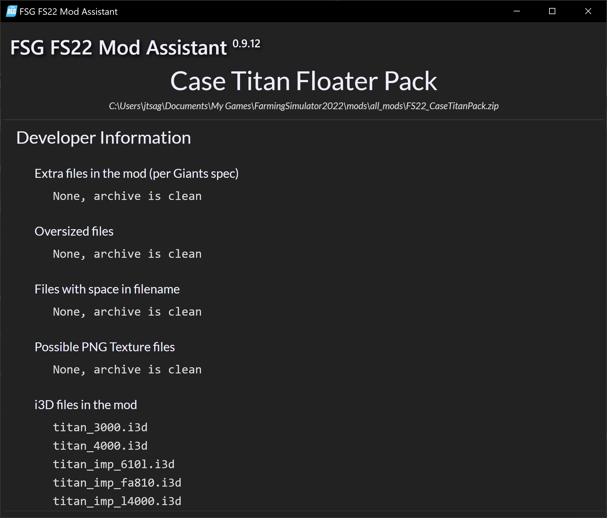

The bottom section of the detail window is for developers, and contains a list of some information they may find helpful in debugging and releasing mods. This is not a replacement for the testRunner, it does not do several of the tests that are included there - however, some of the MP server warning tests are conducted that the testRunner choose to omit.

### Move and Copy

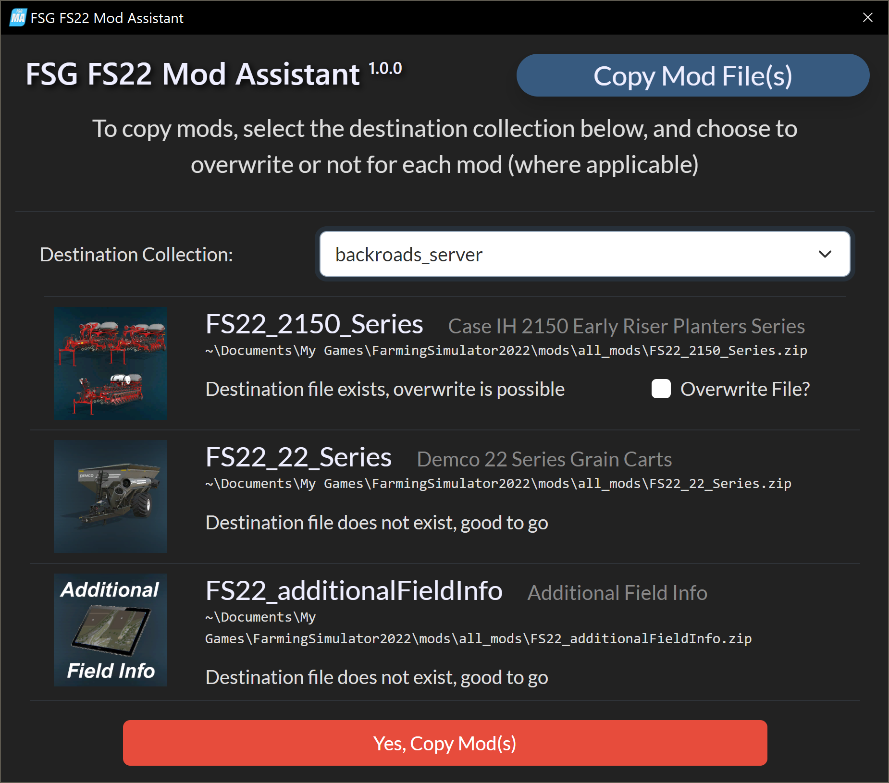

In the move and copy dialog you will see a list of the selected mods, along with a dropdown that will let you choose the destination for the files.  If the file already exists at that location, you will be warned and prompted to `Overwrite File?`, leaving this box unchecked will ignore the file.  To proceed, press the button at the bottom, to cancel simply close the popup window or press `[ESC]`

### Delete

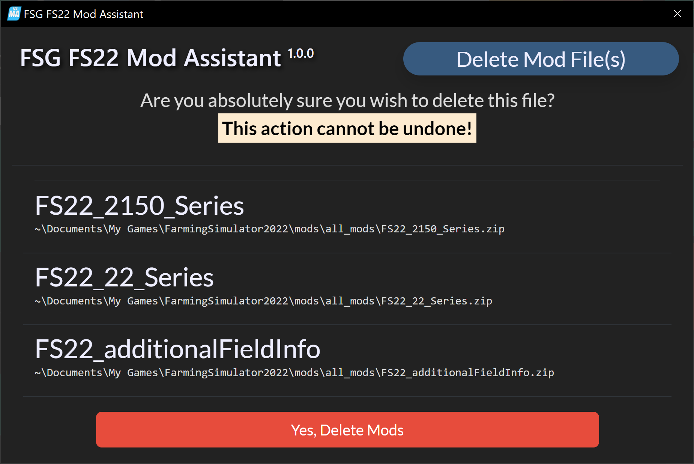

In the delete dialog you will see a list of the selected mods. This is a permanent action, it directly deletes these files, bypassing the recycling bin. To proceed, press the button at the bottom, to cancel simply close the popup window or press `[ESC]`

### Savegame Compare

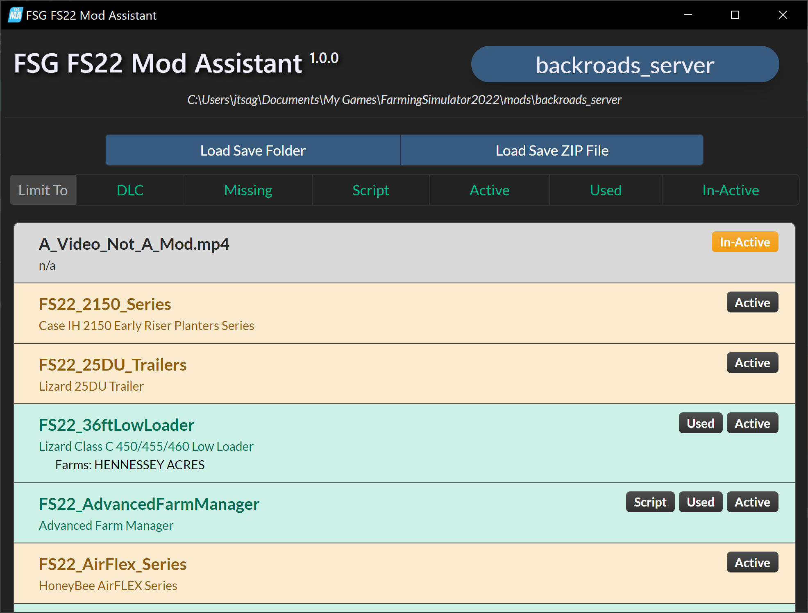

In this display, you can compare a collection to a savegame.  Both savegame folders and zipped save games are supported.  You can use the buttons at the top of the list to filter what is shown. Multiple buttons can be selected at once.

#### Badges Used

- __In-Active__ : This mod is not loaded in the savegame
- __Active__ : This mod is loaded in the savegame
- __Used__ : This mod is used in the savegame (someone owns something from it)
- __Script__ : This mod contains only scripts, so it is assumed it is in use in the savegame
- __Missing__ : This mod is active or used in the savegame, but you do not have the file in your collection
- __DLC__ : This mod is paid DLC content from Giants
- __Version Mismatch__ : The version of the mod used in the savegame and the version in your collection don't match.  For single player, this will fix itself on load, however, for multi-player play, this will prevent you from joining.

### Version Check

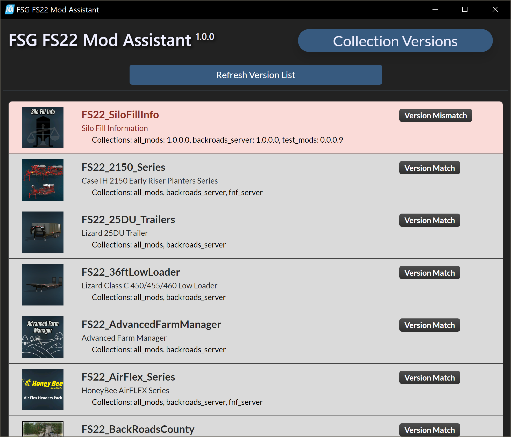

This screen shows you when you have the same mod in multiple collections, and if the versions of those mods match or not.  If the versions differ, you can double click or right click on the mod and a resolution screen will appear

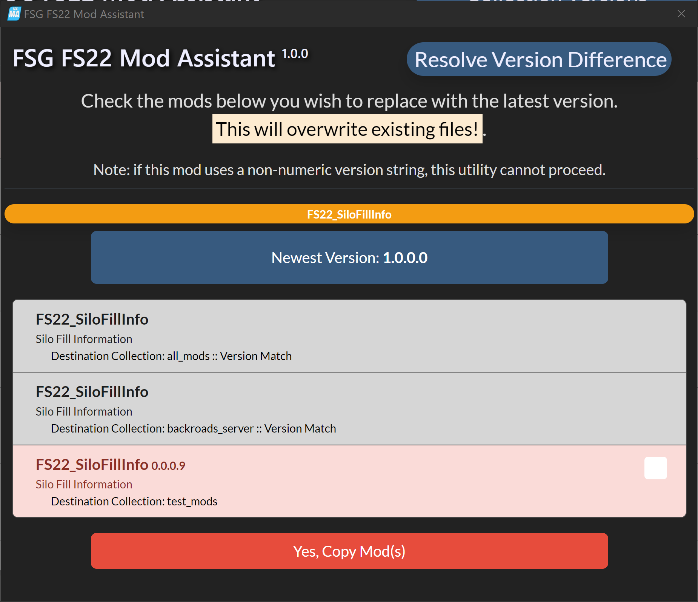

On this screen, you will be reminded of the name of the mod you are working with, and the newest detected version of it.  Note that this tool can only work with fully numeric version strings (`1.0.0.0` or `1.0` is fine, `1.4-beta` is not). Keep in mind this only compares version __numbers__, not the mod files themselves - if you have edited the file, the behavior of this tool is unpredictable. (In other words, always change the version number when you edit a mod)

Check the box next to old versions of mods and press the `Yes, Copy Mod(s)` button to update those collections with the latest version of the mod.

### Edit Folders

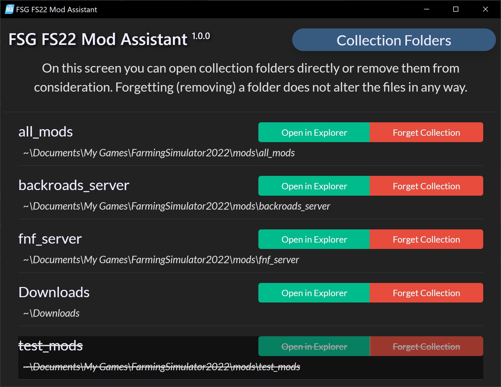

This display will let you change which collections are loaded, and open them in windows explorer if you wish.  In this example, I have "forgotten" the `test_mods` collection, which will update when I close the folder edit window.

### User Preferences

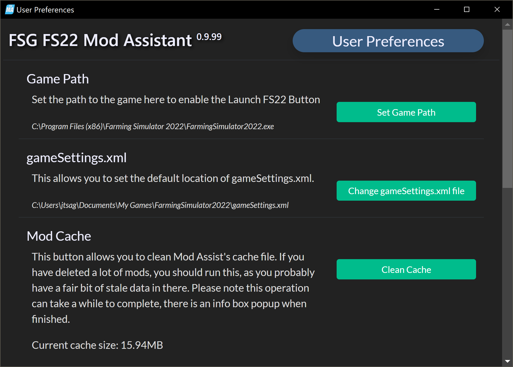

Clicking the `...` button in the upper right corner of the main window will open user preferences.  Most of these are straight forward (window sizes, maximization selection, and UI language override).

#### gameSettings.xml

This option lets you override where the app looks for the gameSettings.xml file. Once in a while, the app may fail to detect it automatically - this is also useful if you have multiple installs of the game.

#### Mod Cache

This button lets you clean out the mod cache for the app.  Under most circumstances, you will need to rarely use this - but if you have recently deleted a large number of mods, this may speed up operation of the app.

## Tips and Tricks

- Think about adding your `Downloads` folder to the program to easily move or copy new mods into your collections.  Mod Assist is pretty smart about what is and isn't a mod, and will happily ignore anything else that might be in your `Downloads` folder.

## Something didn't work?!?

Please open an issue and let me know what.  If it is specific to a mod, let me know where to get the mod.  You can also hit CTRL+ALT+D in the app to bring up the debug log - sending that too might be a good idea.

## Technical Details

### The Mod Cache

This app uses a mod cache based on mod file name, size, and date. As such, it only needs to scan a mod once. Unzipped mods, broken mods, and files that don't appear to be mods are not added to the cache.  The `broken mods` item is important as if you have a _lot_ of broken mods in your mod folder, it can slow down the startup of the app.
