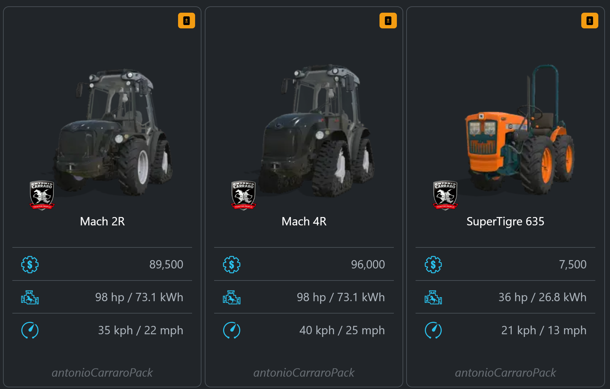
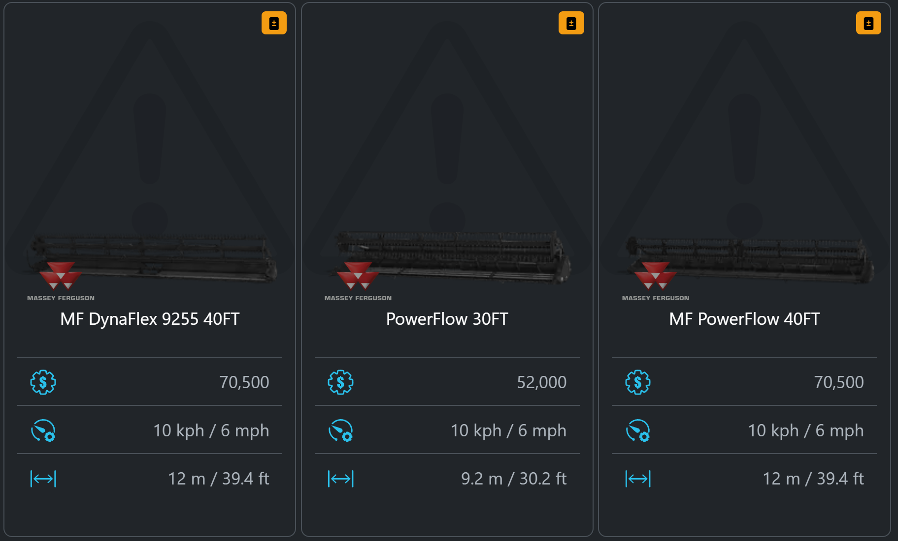
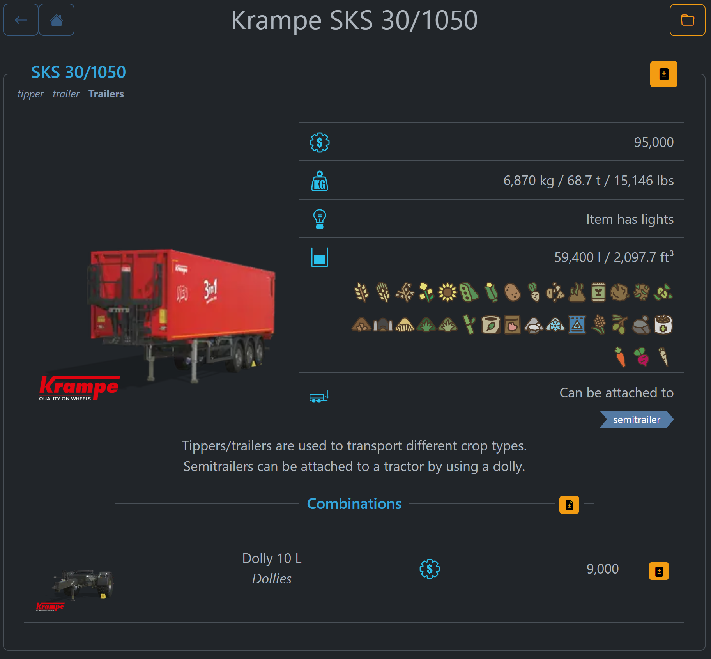

# FSG Mod Assistant - Base Game Browser

[← Back to main](index.html)

## Overview

Sometimes you just need to know what base game equipment is available without going into the game.  Mod Assitant has you covered.  Open it with the <i class="bi bi-wikipedia"></i> icon in the top bar

## Category Screen

Of note, the attachment categories will show you what equipment can be hooked together.  These categories are also linked directly from the mod detail screen.

## Category Lists

Each category or sub-category will have equipment lists, with helpful comparison statistics listed for each item.

Sometimes, however, because of how Giants saved themselves a fair amount of time and effort, an in-game item doesn't have all of the data associated with itself stored the same way - usually this because it is a slightly altered version of something else.  In this case Mod Assistant will show a hazard background to let you know that the item exists, and the stats for it are likely **very close** to what you would find in game.  Clicking on one of these items will bring up the item it is based on. *(maintainers note: If someone really wants to implement a scanner for the sort of not really XPath implementation Giants uses, go for it, and file a pull request)*

## Item Display

The display of individual items should be familiar if you've used the mod detail screen before

## Comparing Items

Throughout the interface, you will see little orange buttons - these will add the item (or items) associated to the [compare tool](comparetool.html)
