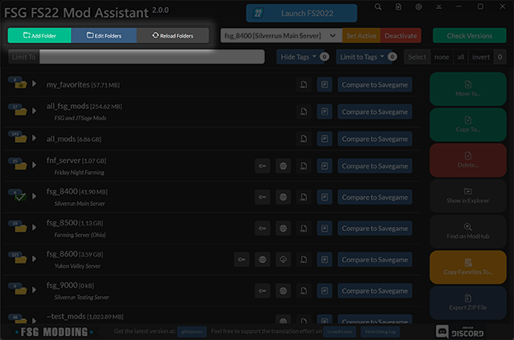
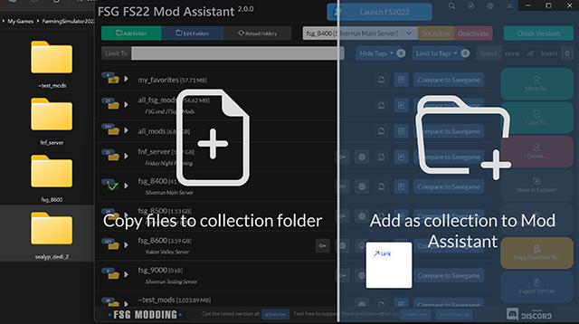
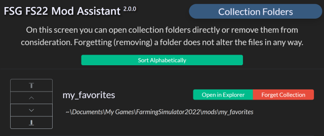
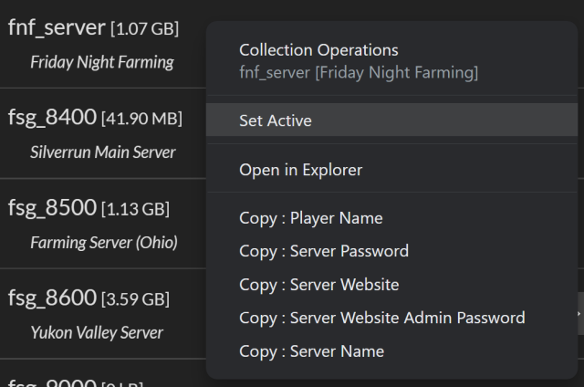
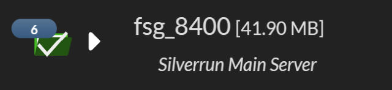

# FSG Mod Assistant - Collection Management

[← Back to main](index.html)

## What are Collections?

Mod Assistant works on the principal of mod collections.  A mod collection is simply a folder full of mods.  There are many ways to set this up, but the one that a lot of us use is to create a set of folders

For my collections, I choose to create multiple folders in the default mods folder.

## Collection Management Functions

Mod Assistant provides a number of tools to manage your collections in the application.

Adding and Editing folders is done using the buttons in the upper right of the interface.

Managing the active collection is done with the button and drop down set at the top center of the interface.

## Adding Collections

To add a collection to Mod Assistant, you can use the `Add Folder` button, or drag and drop a single folder to the interface in the area labeled `Add as collection to Mod Assistant`

## Managing Collections

To manage the order of collections or remove them, use the `Edit Folders` button.

Use `Forget Collection` to remove the folder from Mod Assistant. This will not remove the files or folder from your hard disk.

Use `Open in Explorer` to open the folder in the windows file explorer.

The arrow buttons at the side will allow you to reorder your collections.  From top to bottom they are `Move to top`, `Move Up`, `Move Down`, and `Move to bottom`

## Reloading Collections

To force Mod Assistant to rescan your collections - for instance if you added files yourself - you can press the `Reload Folders` button.  If Mod Assistant has detected changes to your collections it will add a red dot to the button.

## Using Collections

To use a collection in the game, select it from the dropdown list at the center of the interface and then press the `Set Active` button.  This will edit your `gameSettings.xml` file to point Farm Sim to the collection you have selected.

Alternatively, you can right click on a collection and click `Set Active`

If you decide down the line to remove Mod Assistant, or wish you use the standard mod location for whatever reason, you can use the `Deactivate` button.

If the dropdown displays `--unknown--` that means that Farm Sim is set to use a folder that Mod Assistant is not tracking.

## Identifying the Active Collection

The currently active collection will have a green folder icon with a large white checkmark on it.

