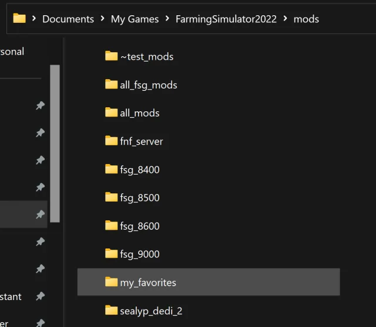
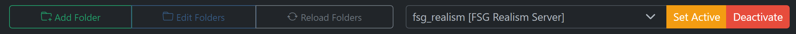
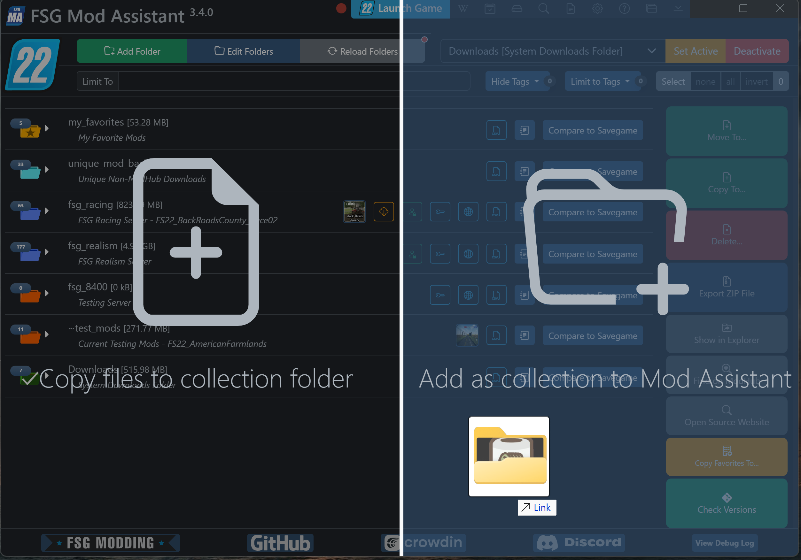
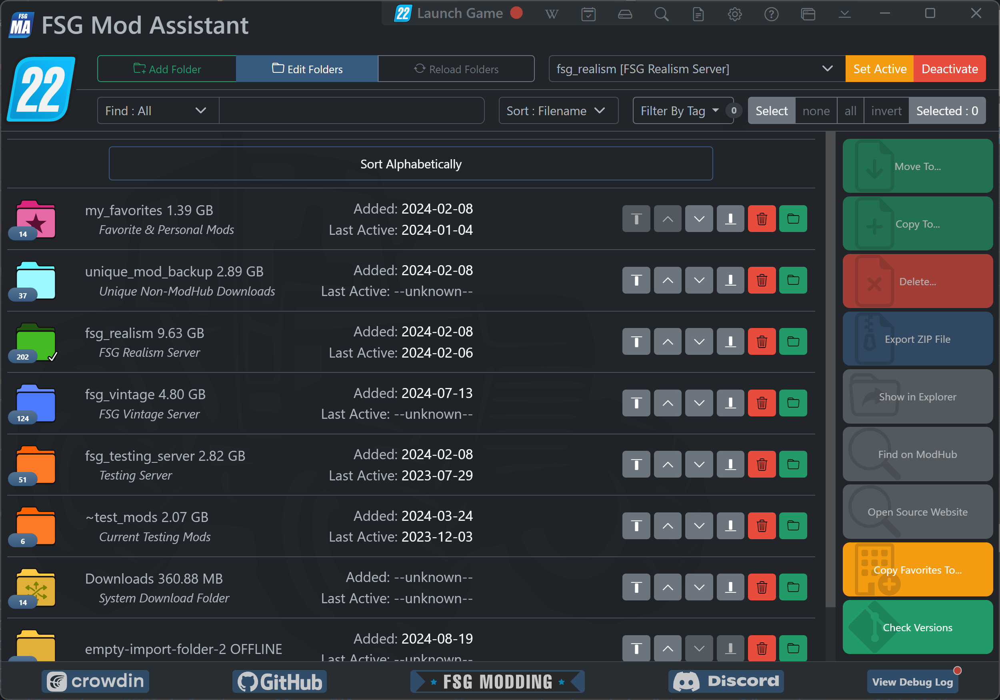
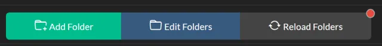
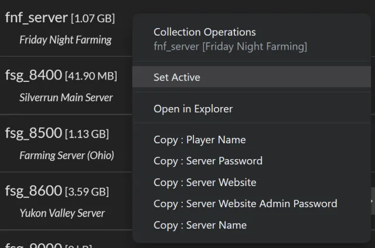
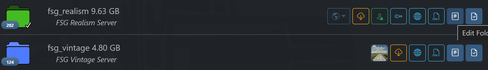
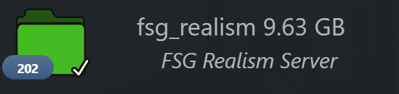
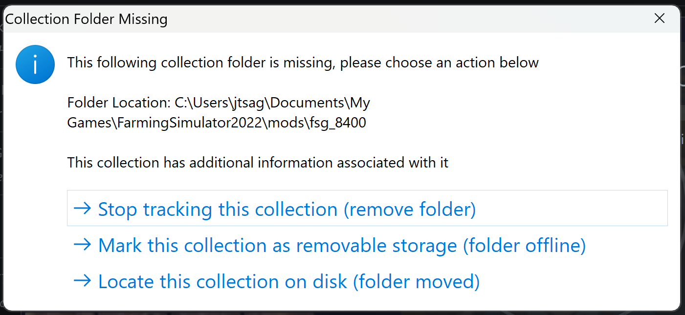
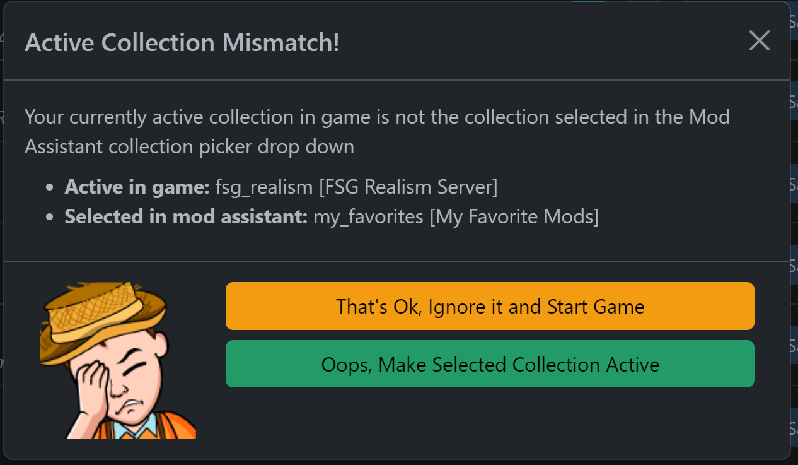

# FSG Mod Assistant - Collection Management

[← Back to main](index.html)

## What are Collections?

Mod Assistant works on the principal of mod collections.  A mod collection is simply a folder full of mods.  There are many ways to set this up, but the one that a lot of us use is to create a set of folders

For my collections, I choose to create multiple folders in the default mods folder.

## Collection Management Functions

Mod Assistant provides a number of tools to manage your collections in the application.

Adding and Editing folders is done using the buttons in the upper right of the interface.

Managing the active collection is done with the button and drop down set at the top center of the interface.

## Adding Collections

To add a collection to Mod Assistant, you can use the `Add Folder` button, or drag and drop a single folder to the interface in the area labeled `Add as collection to Mod Assistant`

## Managing Collections

To manage the order of collections or remove them, use the `Edit Folders` button.

`Added` shows when the collection was added to Mod Assistant (if after version 2.4.0), and `Last Active` shows the last time the collection was marked active in the game

Use <i class="bi bi-trash3"></i> `Trash Can` to remove the folder from Mod Assistant. This will not remove the files or folder from your hard disk.

The arrow buttons at the side will allow you to reorder your collections.  From left to right they are `Move to top`, `Move Up`, `Move Down`, and `Move to bottom`

## Reloading Collections

To force Mod Assistant to rescan your collections - for instance if you added files yourself - you can press the `Reload Folders` button.  If Mod Assistant has detected changes to your collections it will add a red dot to the button.

## Using Collections

To use a collection in the game, select it from the dropdown list at the center of the interface and then press the `Set Active` button.  This will edit your `gameSettings.xml` file to point Farm Sim to the collection you have selected.

Alternatively, you can right click on a collection and click `Set Active`

If you decide down the line to remove Mod Assistant, or wish you use the standard mod location for whatever reason, you can use the `Deactivate` button.

If the dropdown displays `--unknown--` that means that Farm Sim is set to use a folder that Mod Assistant is not tracking.

## Collection Action Buttons

Most of the collection buttons are covered in other sections, most notably in:

- [Collection Details Window](details.html)
- [Savegame Compare](savegame.html)
- [Import and Export](importexport.html)

Not mentioned in any of those is the first icon in this sample - this collection only contains a single map, so the map icon is shown, and clicking it will load the mod detail screen for that map.

## Identifying the Active Collection

The currently active collection will have a green folder icon with a large white checkmark on it.

## Missing Collections

In the event that Mod Assistant cannot find a collection when reloading it's folders, it will pop up a warning allowing you 3 different actions

- "Stop tracking" will remove the collection from the Mod Assistant Application
- "Mark as Removable" will add a special flag to this collection that notes it may not always be available for indexing.  See [Collection Details Window](details.html) for more information on special collection flags
- "Locate Collection" will open a folder browser so you can re-locate the collection if you happened to rename the folder.

## Incorrect Collection Active

Sometimes you have changed the active collection in the dropdown list but either changed your mind, or forgot to press the `Set Active` button - in that case, if you try and launch the game, a popup will show warning you that Farming Simulator may load the wrong mod set.

You can ignore the warning, or set the currently selected mod set as active.  Note that you will have to press the `Launch Game` button again when the process is finished.
