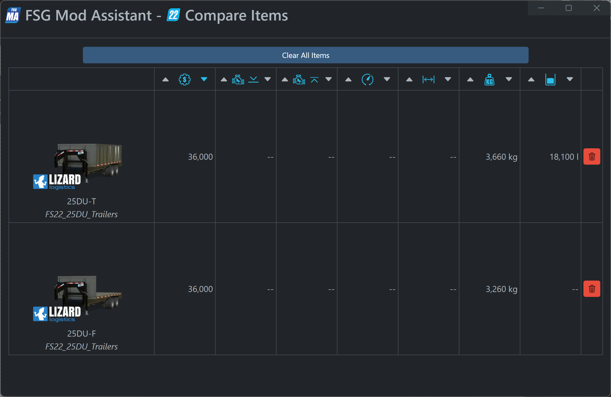

# FSG Mod Assistant - Compare Tool

[← Back to main](index.html)

## Overview

This is a tool to compare multiple items to each other.  It is available in multiple places, and is always denoted by a little orange button with the <i class="bi bi-file-earmark-diff-fill"></i> icon.

Here, you will find sortable columns for price, maximum and minimum engine power (or power requirement as applicable), max speed or implement speed limit, working width, weight, and fill capacity.

The small red trashcan removes an item from the list.
