# FSG Mod Assistant - Collection Details

[← Back to main](index.html)

## Viewing and Using Collection Details

Mod Assistant allows you to set some extra, helpful data on each collection.

The highlighted blue button will open the collection details editor window.

The highlighted `key` will copy that collection's server *website* administration password and the `globe` will open the server website

Right clicking on a collection will bring up a context menu where you can copy most of the detail data to the clipboard.

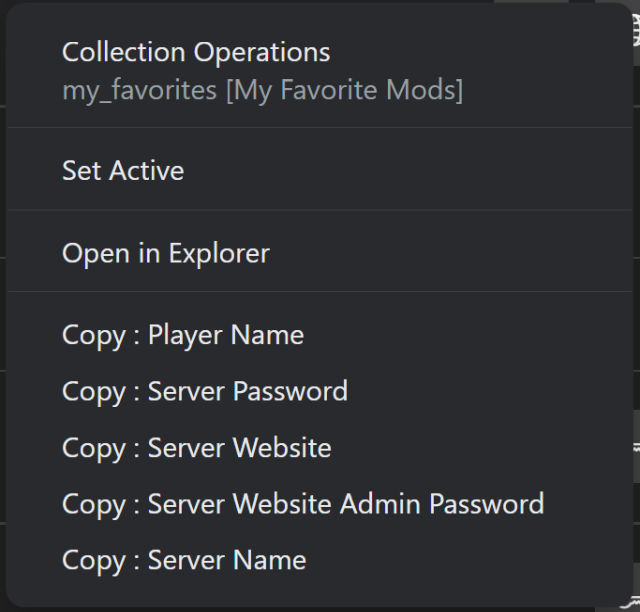

## Editing Collection Details

Clicking on the blue edit details button will bring up the details for that collection. You will find a number of options in there.

### Favorite Collection

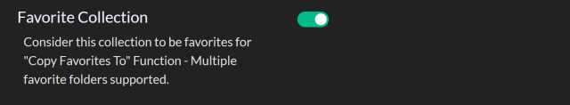

Favorite collections are those collections that the `Copy Favorites To` button works with.  It is visually indicated with a star on top of the folder icon

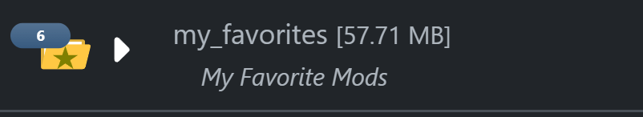

---

### Description

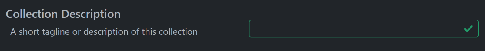

The description displays as a sub-title to the collection in the main interface, and a number of other places.

---

### Player Name

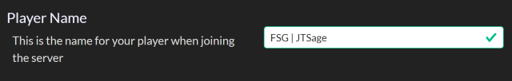

This is what your display name in game will be set to when joining a server with this collection

---

### Server Name

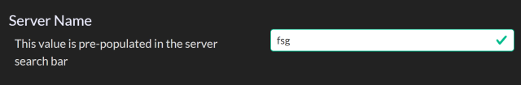

This is the name of the multiplayer server for this collection. It will be pre-populated in the search field in the server browser

---

### Server Password

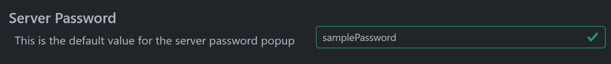

This is the server (game) password for the multiplayer server for this collection.  It will be pre-filled in the password popup when joining

---

### Server Web Site

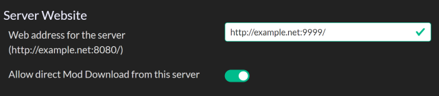

This is the address of the multiplayer server administration website, and a checkbox the indicates if the server has downloading of mods enabled.  Note that the server address *must* follow the indicated format for the download function to work.  This is the website that is opened in your default browser when clicking the `globe` button

---

### Server Web Site Admin Password

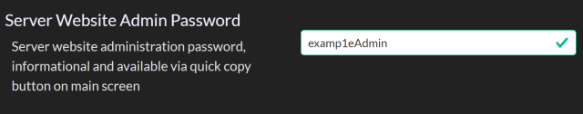

This is the server *website* admin password. It is the password that is copied via the `key` button in the main interface.

---

### Notes

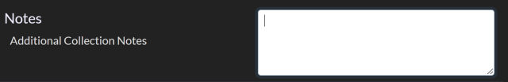

This allows you to set freeform notes on a collection.

---

### Game Version

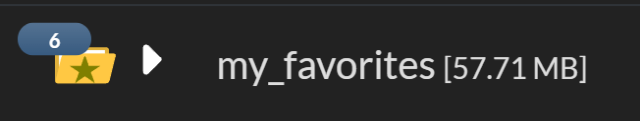

This sets the intended game version for this collection.  This setting will only appear if you have opted into the Multiple Version mode on the preferences screen.
