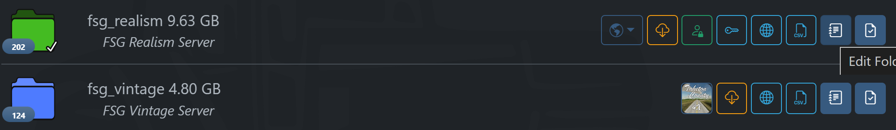
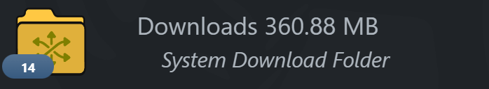

# FSG Mod Assistant - Collection Details

[← Back to main](index.html)

## Viewing and Using Collection Details

Mod Assistant allows you to set some extra, helpful data on each collection.

The dark blue button labeled with <i class="bi bi-journal-text"></i> will open the collection details screen.

<i class="bi bi-key"></i> will copy that collection's server **website** administration password. <i class="bi bi-globe2"></i> will open the server website. Finally, <i class="bi bi-person-lock"></i> will copy that collection's **game** administrator password.

Right clicking on a collection will bring up a context menu where you can copy most of the detail data to the clipboard.

## Editing Collection Details

Clicking on the blue edit details button will bring up the details for that collection. You will find a number of options in there.

### Icon Color

Choose a color for this collection, selected from the FS22 farm colors.

### Favorite

Favorite collections allow mods to be copied from them to *multiple* destinations at the press of a single button near the bottom of the sidebar in the main window.

They look like this in the mod list

### Holding Pen

Holding Pen collections are folders that are not intended to be used in Farming Simulator, but as a place to sort mods.  Clicking copy or move in one of these collections will allow you to copy or move to *multiple* destinations, automatically overwriting any existing file.  I use it for my downloads folder to quickly sort new mods.

They Look like this in the mod list

## Frozen

Sometimes a collection is associated with a server where you do not handle mod updates, or there are custom "versions" of a mod on it - this option will exclude a collection from the Version Management tool

## Removable

This option marks a collection as being on removable storage.  When set as removable, if Mod Assistant can't read the folder on scan, it assumes the drive is unplugged and simply marks the collection offline.

## Version

This sets the game version the collection is associated with.  It will always be preset to the version you are currently working with in Mod Assistant, or, if you do not have multi-version support enabled, it will be set to 2022

## Description

This sets a text description for the collection. In the above mod list samples, the description text is the second line in italics.

## Player Name

This sets your player display name for this collection.  Only useful for multiplayer, but this allows you to have different names on different servers easily

## Server Name

This sets the server name, or, more accurately, it pre-populates the multiplayer server search box with this value.  It is recommended to keep as simple as possible.

## Server Password

This is the password that is required to join the server.  It is **not** your farm password, or the online web based administration tool password.  Setting this will pre-populate the server join password popup box allowing you to just click OK or press enter

## Website

This is the website for multiplayer game administration.  Additionally, if mod download is turned on for the server, you can toggle it on here to allow one-click mod download from that server into your collection folder (note that this cleans the collection first, then downloads the new mods).  If you need to put a non-standard style of server address in, you can toggle off the "Force Valid" option, but this will disable mod download.  It is available via collection right-click, or with the <i class="bi bi-globe2"></i> icon.

## Website Admin Password

This is the password for the website administration, available via collection right-click or with the <i class="bi bi-key"></i> icon.

## In-Game Admin Password

This is the password for administrator inside a multiplayer game.  It is available via collection right-click or with the <i class="bi bi-person-lock"></i> icon.

## In-Game Units

These are the measurement units that are used in the game.  They are pre-populated from your current game settings, but if you have need of specific units for individual collections, you can do that here.  Note that if you change your mind on "default" units later, you will need to update each collection.

## Notes

This provides a text field for any notes you have. They are only visible on this screen.

