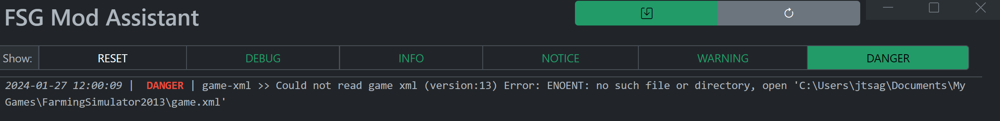
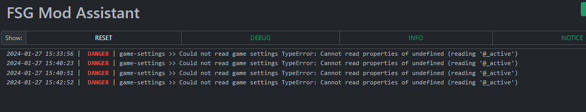
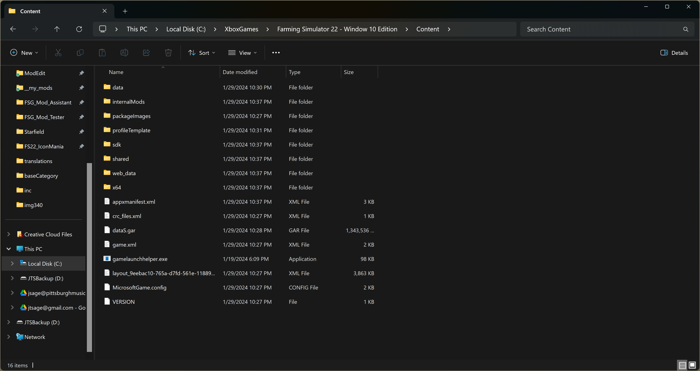

# FSG Mod Assistant

[← Back to main](index.html)

## Frequently Asked Questions

### Do you have any time saving tips?

Yes. Think about adding your `Downloads` folder to the program to easily move or copy new mods into your collections.  Mod Assist is pretty smart about what is and isn't a mod, and will happily ignore anything else that might be in your `Downloads` folder.  For bonus points, set your `Downloads` folder to be of the 'Holding Pen' type (see collection details)

---

### What does this mean (gameSettings)?

The most common error with game settings is an invalid path - that looks like this:

In this case, go into settings and set the correct path to the file.  If it has happened since MA was working correctly, the file may have been destroyed - start and stop the game and it will re-create the file for you.

Another somewhat common error can occur if your gameSettings.xml file gets corrupted - most commonly this is due to MA writing to the file at the same time the game does (A good tip is to not update your active collection while the game is running)

That error will look something like this:

To fix this, the easy way:

1. __stop__ Mod Assistant and Farming Simulator
2. __navigate__ to the `gameSettings.xml` file and __delete__ it.
3. __start__ Farming Simulator
4. __stop__ Farming Simulator
5. __start__ Mod Assistant and everything should be fine again!

---

### What should I do if something doesn't work?

Please, report it to us!

Please [Open an Issue](https://github.com/FSGModding/FSG_Mod_Assistant/issues/new/choose) and let me know what.  If it is specific to a mod, let me know where to get the mod.  You can also hit CTRL+ALT+D in the app to bring up the debug log - sending that too might be a good idea.

If the app hard crashes (you'll get a popup message), the crash log can be found in (v1.2.0+ only):

`C:\Users\YOU\AppData\Roaming\fsg-mod-assistant` - please include `crash.log` and `assist.log` in your issue report.  Thanks!

---

### Does this support Linux or Mac?

No, not at this time.  We lack the resources and hardware to properly test it. There are also a few windows-only tools that are used by Mod Assistant that would be non-trivial to port to another operating system, specifically the icon image converter.

---

### Does this support symLinks?

One method to keep the size of a mod collection down is to use symlinks - Mod Assistant is aware of symlinks, and will treat them much like the game does - like any other mod file.  Mod Assistant does not have any sort of built in sym link functions, you'll need a third party app or advanced knowledge of the command line to create them.

When doing file operations

- `Move`ing a symlink will move the __LINK DESCRIPTOR__ (the linked file remains unchanged)
- `Copy`ing a symlink will copy the __ORIGINAL FILE__ (the linked file is duplicated)
- `Delete`ing a symlink will delete the __LINK DESCRIPTOR__ (the linked file remains unchanged)

Note that invalid links in your folders will be ignored, however a warning message will be added to the debug log.

Due to how windows handles the permission for creating symlinks, it is not currently possible for Mod Assistant to make them

---

### Can I launch the game if I have the XBox Store version of Farming Simulator?

Yes, you can! In this situation, you need to set the launch path __and__ name to something different.  After opening settings, and pressing the folder icon next to the game path entry, make sure you set the file type filter (bottom right of the popup) to "all files".  Then select `gamelaunchhelper.exe` in the folder shown below.  Note that if you have installed XBox store items to a different folder or drive, the path may be different.

---

### How does the mod cache work?

This app uses a mod cache based on mod file name, size, and date. As such, it only needs to scan a mod once. Unzipped mods, broken mods, and files that don't appear to be mods are not added to the cache.  The `broken mods` item is important as if you have a _lot_ of broken mods in your mod folder, it can slow down the startup of the app.

Also, be aware, that sometimes when adding a new feature, the cache may need to be re-created, making the loading time increase a great deal.

If you are syncing your mods between multiple computers, and Mod Assistant insists on re-scanning everything constantly, take a look at the "OneDrive Sync Mode" in user preferences.
