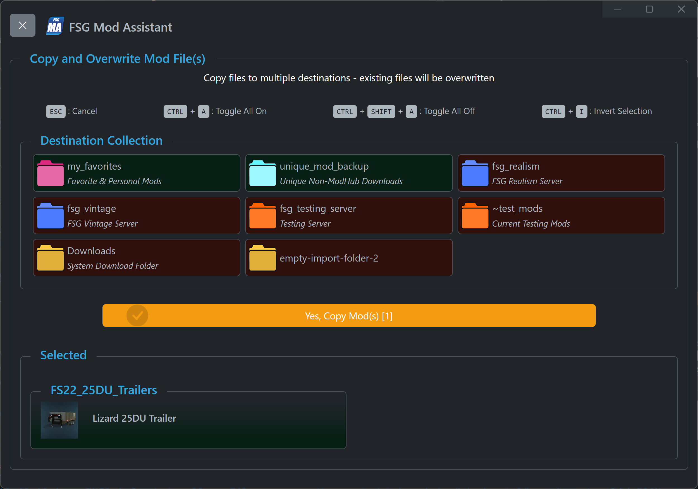
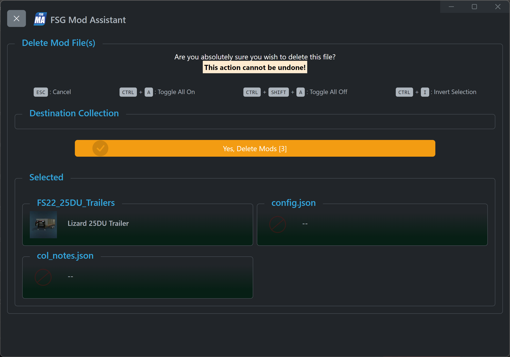

# FSG Mod Assistant - File Operations

[← Back to main](index.html)

## Overview

There are several file management operations available.  You can Copy, Move, Delete and Copy Favorites.  All file operations in Mod Assistant can be canceled with the `ESC` key.

## Move or Copy - Single Collection

Moving or copying files brings up a confirmation window.  Choose a destination to and press the `Yes` button to continue.  You can choose to overwrite files if you like, check the box next to the conflicting mods.

You can press `CTRL+A` to select all, and `CTRL+SHIFT+A` to deselect all overwrite options

For better display, paths are shortened, hover over the path to see the full path.

## Move or Copy - Multiple Collections (Dropbox)

Moving or copying files **from a dropbox collection** brings up a confirmation window.  Choose a destination to and press the `Yes` button to continue.  Exiting files will be automatically overwritten.

## Delete

Press the delete button to open a confirmation dialog to delete mods from a collection.  This operation **does** remove the file from disk completely - it can **not** be undone.  Press the `Yes` button to continue.

## Copy Favorites To

This option will copy the contents of any favorite collection(s) to the collection(s) of your choice.  Check the collections you wish to copy to.  This will overwrite files if they already exist.

