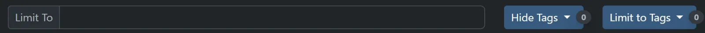
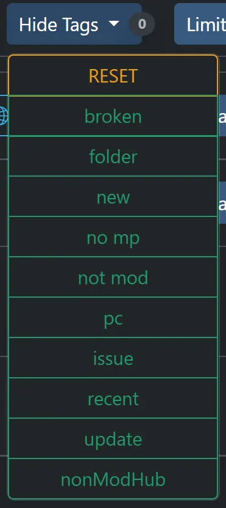

# FSG Mod Assistant - Filter Tools

[← Back to main](index.html)

## Filter Bar Overview

The filter bar allows you to filter your mod collections

## Limit To field

This field allows you to limit to the mods that are displayed. This is a full text search of the Name, Title, and author field of the mod.  You can use an exclamation mark `!` at the beginning of the line to search for mods that *do not* match the string.  Note that this will not filter selected mods.

## Hide Tags and Limit to Tags

These dropdowns allow you to filter mods by tag

For more information about what the tags mean, see the [Collection Area](mods.html) section.

### Hide Tags

This will hide mods that have **any** of the selected tags.

### Limit to Tags

This will hide mods that do not have **all** of the selected tags.
