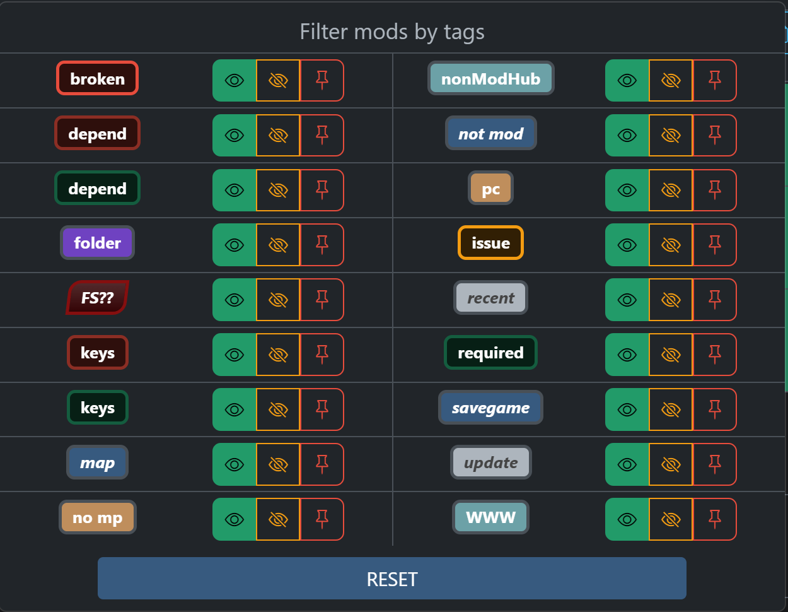

# FSG Mod Assistant - Filter Tools

[← Back to main](index.html)

## Filter Bar Overview

The filter bar allows you to filter your mod collections

## Limit To field

This field allows you to limit to the mods that are displayed. This is a full text search of the Name, Title, and author field of the mod.  You can use an exclamation mark `!` at the beginning of the line to search for mods that *do not* match the string.  Note that this will not filter out currently selected mods.  If you require more specific searching, you can use the dropdown to search only on title, author, or file name.

## Mod Sorting

By default, mods are shown sorted by their filename.  The sort feature allows you to order by Title, Author, Version, or File Date (oldest first)

## Hide Tags and Limit to Tags

These dropdowns allow you to filter mods by tag

For more information about what the tags mean, see the [Collection Area](mods.html) section, or hover over them.

This list is built dynamically from your mod set, so only those tags that exist in your collections will be provided.

The green open eye indicates that mods __MAY__ have that tag.

The orange closed eye indicates that mods __MAY NOT__ have that tag.

The red pin is special and indicates that that mods __MUST__ have that tag.

For instance, you could use the red pin on "map" and "recent", then the orange closed eye on "issue" to show only map type mods that have been recently updated, but not any that have detected issues.
