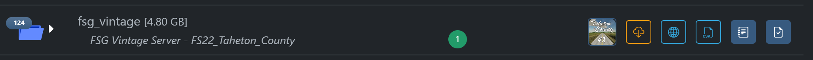
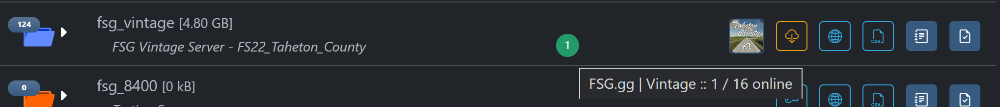
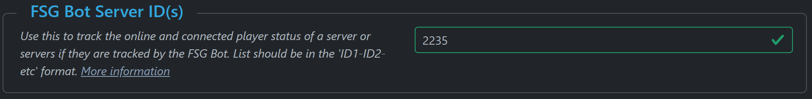

# FSG Mod Assistant - FSG Bot Integration HowTo

The Farm Sim Game discord bot is a comprehensive Discord Bot and Web Site system - some of the key features are:

- Live Player Stats
  - Our servers keep track of players on your servers to display live stats with our Discord Bot.
- Community Management
  - We have a fully featured bot that can help you manage your Discord community.
- Privacy Protection
  - We are always working to improve security across our Discord Bot and servers.
- Always Online
  - Our servers scan dedicated servers 24/7 to keep server data up to date.
- Player Activity
  - View player activity on our website and display on your Discord via our custom Bot.
- Expand your Server
  - Expand your FS Dedicated Servers with our ever growing server profiles.

For more information, you can check out the [FarmSimGame Website](https://farmsimgame.com/)!

## Integration Options

If a collection is intended for use on a server that is currently listed on the FarmSimGame website, you can display it's status and how many players are logged in right in the Mod Assistant interface - It looks something like this:

Notice the green bubble with a 1 in it - that lets you know the server is online, and has 1 player logged in!  You can hover over for more information

### Configuration

To configure this next bit, you will need the server ID (or ID's for multiple) from the FarmSimGame website.

In this example, we will use the [FSG vintage server](https://www.farmsimgame.com/Server/2235) - the listing page is at `https://www.farmsimgame.com/Server/2235`, and in this case, the server ID is `2235`.

Open the collection details settings with the dark blue button labeled with <i class="bi bi-journal-text"></i>

Scroll down to the FSG Bot Server ID section

Enter the server ID (or IDs) here.  You should separate server ID's with a dash (e.g. `1-2-3-4`), but you can use any non-numeric character and Mod Assistant will fix it when you leave the input field.

Then, close the collection detail window, and refresh your folders.  The server status will appear within a few minutes.  In order to keep the server load down, the stats are updated only once every 5 minutes or so.  The indicators are green for online, red for offline, or grey if the server ID was not recognized.
