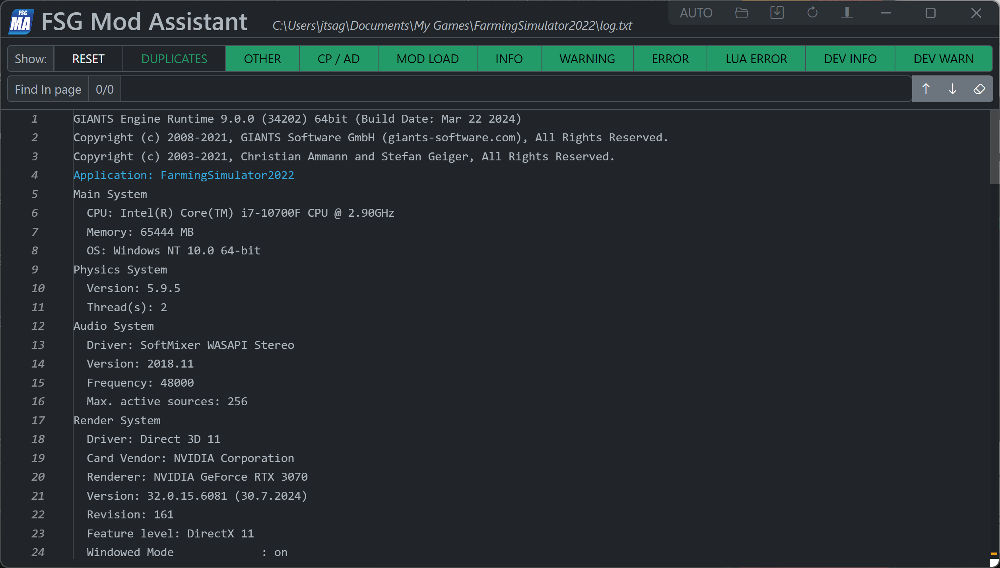

# FSG Mod Assistant - Game Log

[← Back to main](index.html)

## Overview

To open the game log, click on the <i class="bi bi-file-earmark-text"></i> icon located in the top bar of the main interface.

This window allows you to view and filter your game log file.

The buttons on the right side, from left to right are:

- Set log file to `AUTO` - this will follow the game version in multi-version mode.
- Change log file location (you can load any log file you wish)
- Open log on disk (with explorer)
- Reload log file
- Auto-scroll to bottom
  - When running the game with this window open the log will auto-update.  Click this button to keep it scrolled to the bottom as new text comes in.
- Clear the log file.  This will clear the contents of the opened log file. Particularly useful if you are using command line flags that prevent the log from resetting itself on game launch.

Searching is provided, along with a number of filter buttons.  Of note, the "duplicates" button is off by default - that means the duplicate lines (with no different items between them) will be suppressed and a count bubble will be presented to the left of that line instead of showing it multiple times.  Click this filter to suppress this behavior.

New in 5.0.0, if your log is less than 5,000 lines, the scrollbar will be overlaid with orange for warnings and red for errors to assist in finding problems quickly.  This line limit may change in future versions as this feature is performance limiting.
