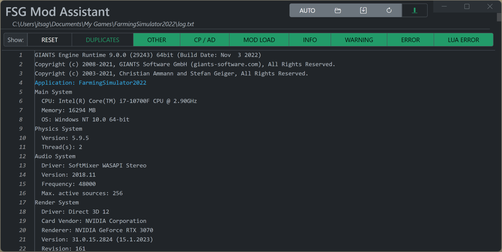

# FSG Mod Assistant - Game Log

[← Back to main](index.html)

## Overview

This window allows you to view and filter your game log file.

The buttons on the right side, from left to right are:

- Change log file location (you can load any log file you wish)
- Open log on disk (with explorer)
- Reload log file
- Auto-scroll to bottom
  - When running the game with this window open the log will auto-update.  Click this button to keep it scrolled to the bottom as new text comes in.
