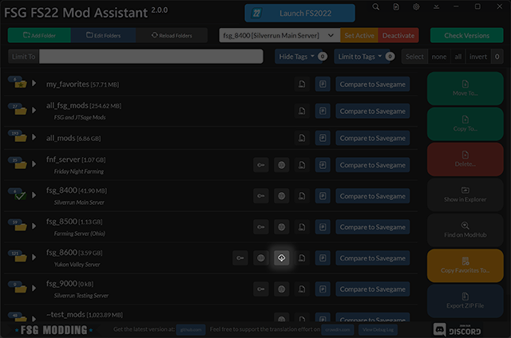
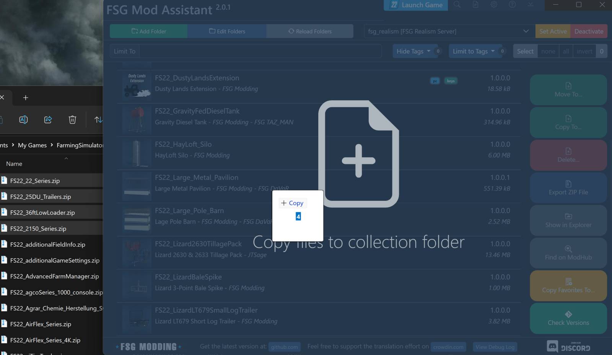
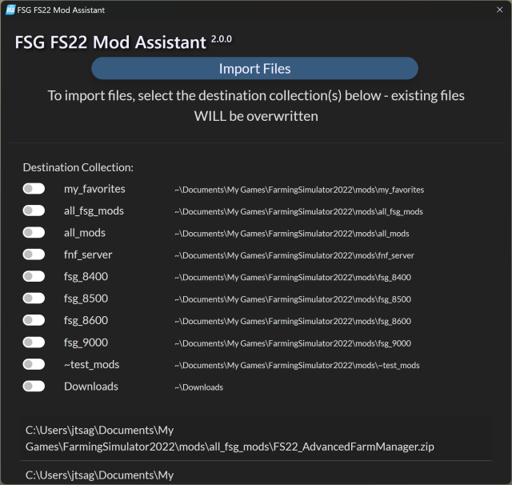
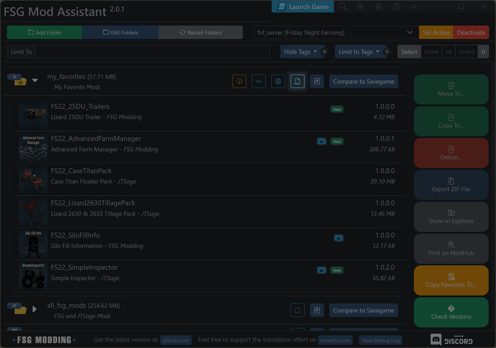
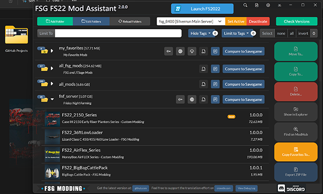

# FSG Mod Assistant - Import & Export
[← Back to main](index.html)

## Overview

Mod Assistant does not try to be a full featured file manager, but it does have a few options for importing and exporting mods directly from the interface

## Import

To add mods directly to Mod Assistant, you have 2 options - direct download and drag-and-drop.

### Direct Download

For collections that have an associated dedicated server website, and download enabled, you can press the download button next to the collection name.  This will download **and overwrite** the mods from the server to the collection.  It will not delete any *extra* mods that exist in the collection.

### Drag-and-Drop Import

You can drop files and folders to the main interface window.  If you are dragging in a single folder that is a mod, be sure to choose the `Copy files to collection folder` option.

You will be presented with a dialog where you can choose to copy the files to one, some, or all of your collections. Note that any existing files will be overwritten.

## Export

To copy mods out of a collection, you also have 2 options - export as a ZIPped archive, or drag-and-drop

Additionally, you can export a CSV list that describes your collection

### ZIP Archive

To export files to a ZIP, select one or more mods in the collection area and press the `Export ZIP File` button to be prompted where to save the new ZIP file.

### CSV List

Next to each collection is a small `CSV` button. You will be prompted where to save the CSV file.

### Drag-and-Drop Export

You can drag single mods from the collection area to any valid target in windows.  Valid targets are the desktop, an explorer window, and any number of third party apps that support dragging a file directly to them (for example, Discord)

