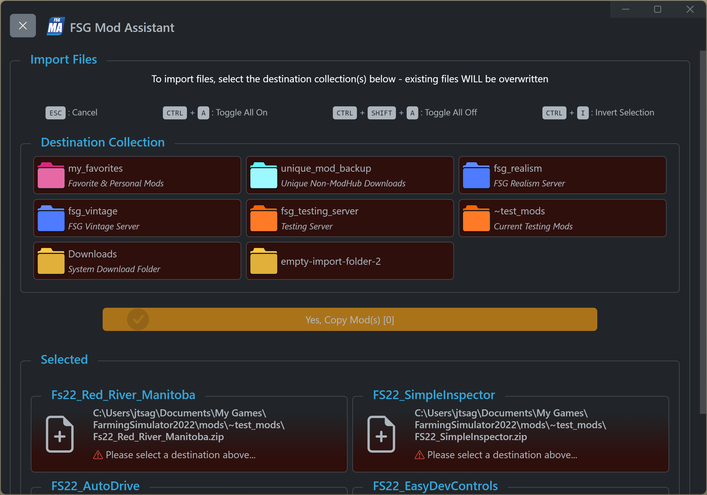
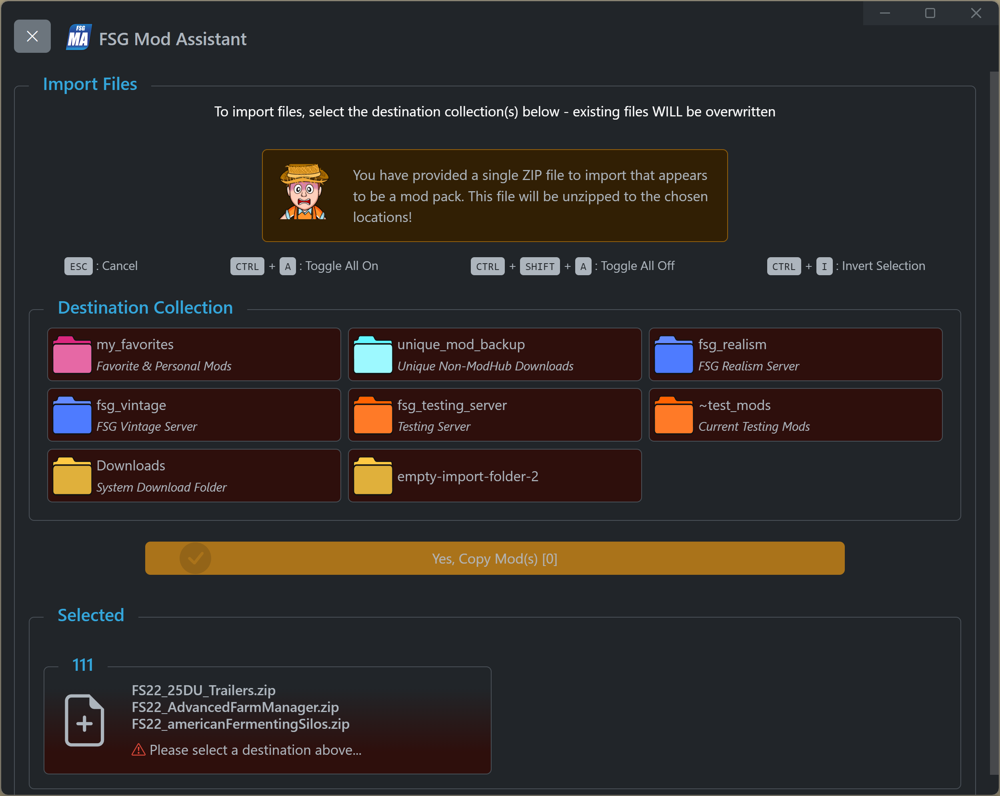

# FSG Mod Assistant - Import & Export

[← Back to main](index.html)

## Overview

Mod Assistant does not try to be a full featured file manager, but it does have a few options for importing and exporting mods directly from the interface

## Import

To add mods directly to Mod Assistant, you have 2 options - direct download and drag-and-drop.

### Direct Download

For collections that have an associated dedicated server website, and download enabled, you can press the orange download button <i class="bi bi-cloud-download"></i> next to the collection name.  This will download **and overwrite** the mods from the server to the collection.  It will not delete any *extra* mods that exist in the collection.


---

### Drag-and-Drop Import

You can drop files and folders to the main interface window.  If you are dragging in a single folder that is a mod, be sure to choose the `Copy files to collection folder` option.


You will be presented with a dialog where you can choose to copy the files to one, some, or all of your collections. Note that any existing files will be overwritten.



### Drag-and-Drop Import Package

If you have exported a mod collection (or part of one), those ZIP files are specially detected by Mod Assistant and will unzip their contents on import.



## Export

To copy mods out of a collection, you also have 2 options - export as a ZIPped archive, or drag-and-drop

Additionally, you can export a CSV list that describes your collection

### ZIP Archive

To export files to a ZIP, select one or more mods in the collection area and press the `Export ZIP File` button to be prompted where to save the new ZIP file.


---

### CSV List

Next to each collection is a small `CSV` icon <i class="bi bi-filetype-csv"></i>. You will be prompted where to save the CSV file.


---

### Drag-and-Drop Export

You can drag single mods from the collection area to any valid target in windows.  Valid targets are the desktop, an explorer window, and any number of third party apps that support dragging a file directly to them (for example, Discord)


## Import & Export of Collections

There is support for importing and exporting collection settings.

### Export Collection

Right click on the collection, and choose "Export Settings (JSON)"


---

### Altering Export Details

The import / export JSON format is defined below. Most of the options are directly from the collection detail settings, the two additional fields are available for single mod download (no unzip) and mod pack download (unzip) at import time.

```json
{
    "collection_color": 6,
    "collection_description": "Test Import Server",
    "download_direct": [
        "https://example.net/my_mod_collection.zip"
    ],
    "download_unzip": [
        "https://example.net/FS22_SingleMod.zip"
    ],
    "force_frozen": true,
    "game_version": 22,
    "server_downloads": false,
    "server_id": "1-2-3-4",
    "server_name": "server-name",
    "server_password": "server-join-password",
    "server_website": "http://example.net/"
}
```

---

### Import Collection

To import a collection drag-and-drop the JSON file to the Mod Assistant window.  A New window will appear

The first section of the window will give you an overview of the collection being imported.


#### Step 1

First, select where on disk you would like to store the collection.  You can use an existing folder (for instance, if updating a collection, or you already made the folder), or, you can create a new folder in the dialog that appears.


Once you have selected the folder, press the "Apply Settings" button to apply the included settings.  The button becomes enabled after selecting a location, and turns green when it is finished.

#### Step 2 (optional)

Optionally, you can include one-time downloads in an exported collection JSON file - if you do, they are available to download here.  The buttons become available once you have selected a location on disk to store the collection.  The buttons turn green when they are finished.  Please note that these downloads will overwrite any existing files.


Mod pack style downloads will be unzipped after download, single mods will just be stored in the collection folder.
