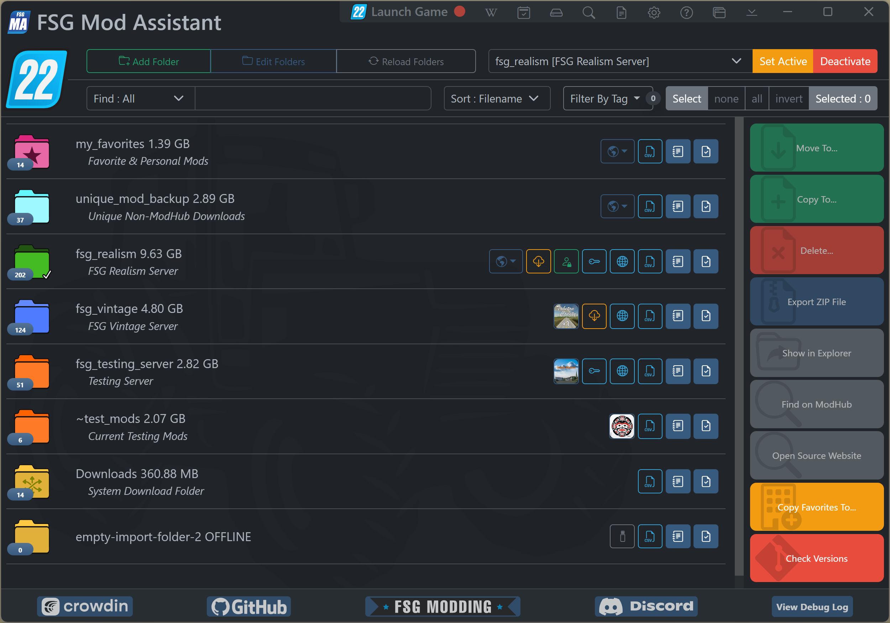

# FSG Mod Assistant

   

___This is a mod folder switcher with extra tools___

- Check mods to ensure that they (probably) work in game
- Check a collection against a save game to see what is used and what is not
- Resolve version differences of mods between collections

## What this does

At it's core functionality, this is a file manager, and it has the ability to edit FS22's `gameSettings.xml` file to set one of your mod collections as the mod location the game reads.

## Detailed Documentation

Please note that this documentation is auto-generated, and may refer to a newer version than you currently have.  If things look a little different, rest assured that you will soon have the features mentioned

- [Main Interface Overview](main.html)
- [Filter Tools](filter.html)
- [Collection Area](mods.html)
- [Collection Management](collections.html)
- [Collection Details Window](details.html)
- [Import and Export](importexport.html)
- [Move and Copy and Delete and Copy Favorites](fileoper.html)
- [Savegame Compare](savegame.html)
- [Savegame Mod Track](savetrack.html)
- [Version Check](versions.html)
- [Search All Collections](search.html)
- [Detail Window](moddetail.html)
- [User Preferences](preferences.html)
- [Game Log Viewer](gamelog.html)
- [Multiple Game Version Mode](multi-version.html)
- [Frequently Asked Questions](faq.html)

## What is a Broken Mod?

- If a mod file is named incorrectly and won't load in the game.
  - Suggest it might be a copy if the name looks like a copy
    - and what the name probably should be
  - Suggest you extract it if it looks like a collection of mods

- If a mod is not properly zipped.
  - Suggest that you zip it up
  - Suggest you move the contents of the folder if it looks like a mod pack
  - Suggest you remove the folder if it looks like garbage

- If a mod is not intended for FS22 (e.g. FS19 & FS17 mods)
  - Warn that you can't use it with this version

- If a file exists that is not a mod at all
  - _NOTE:_ `prefab`s will also show as non-mods, as for the purposes of Mod Assistant, they are not valid
  - Suggest you remove the file

## Usage

Download the installer for your platform from the [Releases](https://github.com//FSGModding/FSG_Mod_Assistant/releases) page - the program will install with 1-click, and auto-run when it's ready.

### Download options

Builds are available for the following:

[Latest Release](https://github.com/FSGModding/FSG_Mod_Assistant/releases/latest)

- __win x64 Installer__ : with auto updating
- __win x64 Portable__ : no need to install, but no auto updating

### Install & How-To Videos

### Updating

Either download the new version and install over top, or, the program will self-update itself every time you start it (downloads silently, installs on demand or at exit)

### Mod Assistant Speed

__PLEASE READ: Note about the Mod Cache:__ Mods are scanned and cached from disk so that this app can run as fast as possible - but the initial scanning process is in depth, and ___not very fast___.  So, be aware than when you add a folder of a lot of mods, it may take a bit of time to scan them for the first time. Mod Assistant goes out of it's way to only scan a "version" of a file once, so subsequent loads on the program will be much, much fast.  If you are interested in the details of the cache, see the FAQ. If you find that your collections continue to full rescan, you may need to enable sync mode - see the page on [User Preferences](preferences.html)

## Translations and Localizations

Some effort has been made to produce a version of Mod Assistant in your preferred language, but as the creators only speak english, we need help on this.  We accept pull requests, and we have an active [CrowdIn](https://crowdin.com/project/fsg-mod-assistant) project.  Many, many thanks to all of the folks who have contributed so far to this effort!
