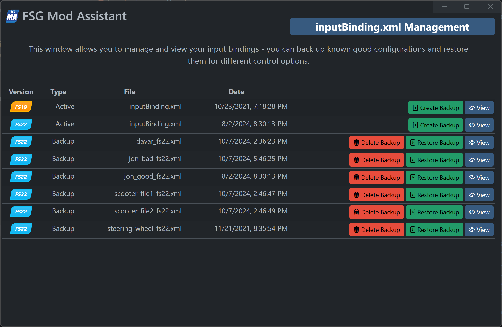
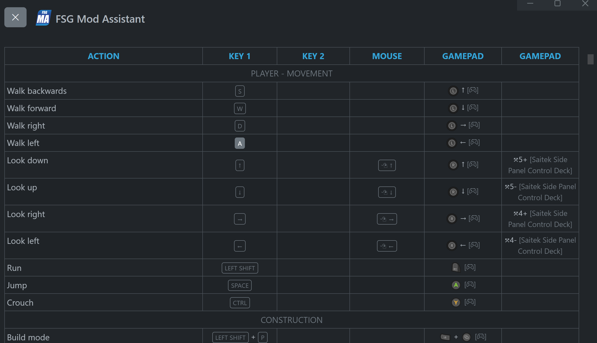

# FSG Mod Assistant - inputBindings.xml Management

[← Back to main](index.html)

## Overview

If you have multiple controller sets, you may find the inputBinding.xml management tool useful.

You can backup your active settings to a file, with or without a version tag, and delete or restore those backups.  You can also view the bindings available.

## View Screen

Note that the localized strings for mods are not available in this view, however the internal names are shown.  At this time, (and probably forever), you will need to be in-game to make changes.
