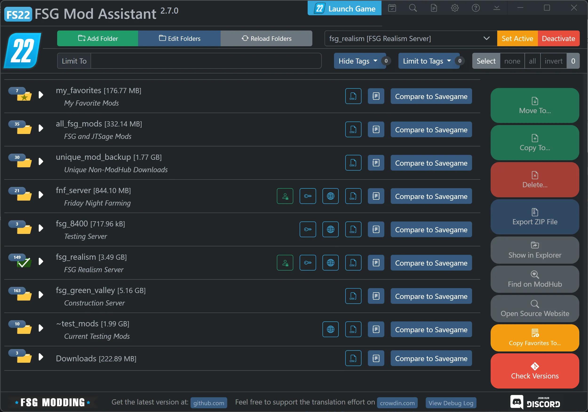
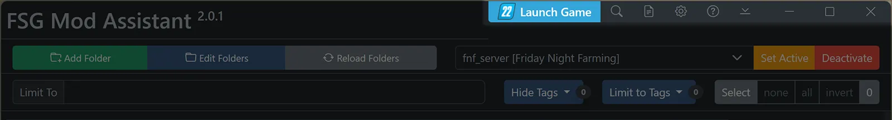
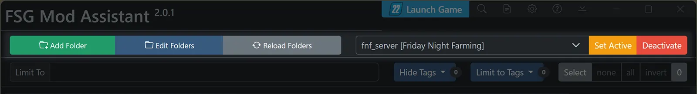
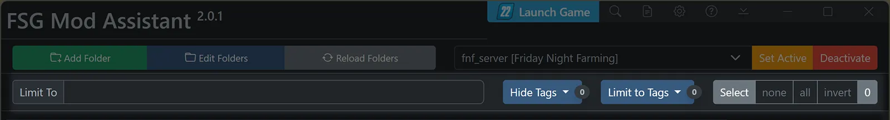
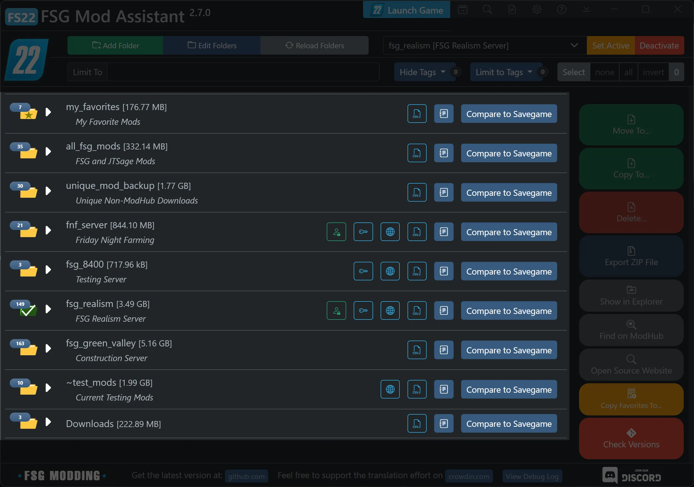
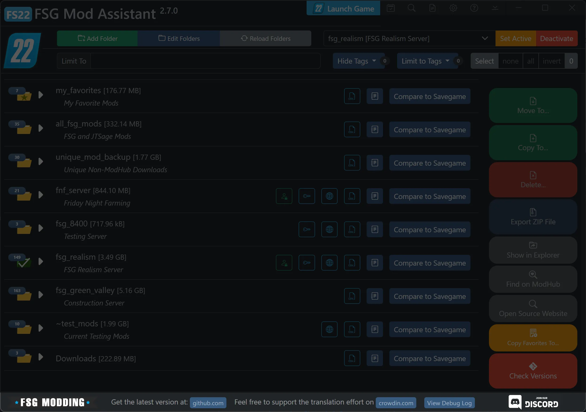

# FSG Mod Assistant - Main Interface

[← Back to main](index.html)

This is what Mod Assistant looks like.  Below, the 4 main areas are broken down with links to more information.

## Top Bar

This area contains functions that tend to apply everywhere, grouped to take up as little space as possible.

On the top line, you'll see the application title (drag to move the window), a game launch button, and the title bar buttons.

From left to right, those buttons are:

- __Calendar :__ [Savegame Mod Tracking](savetrack.html)
- __Spyglass :__ [Search All Collections](search.html)
- __Text File :__ [Game Log Viewer](gamelog.html)
- __Gear :__ [User Preferences](preferences.html)
- __Question Mark :__ Quick Link to this Help Document
- __Down Chevron:__ Minimize app to taskbar
- Standard Minimize, Maximize, and Close

Next line down, you will find the 3 folder buttons and the 3 collection controls which form the [Collection Management](collections.html) section.

The last line in this section contains some selection buttons and the [Filter Tools](filter.html)

## Collection Area

The collection area is the main interface of Mod Assistant.

From here, you can easily launch or perform the functions detailed in:

- [Collection Area](mods.html)
- [Collection Details Window](details.html)
- [Savegame Compare](savegame.html)
- [Detail Window](moddetail.html)

## Sidebar Area

This area contains functions for working directly with mods.

Among those functions are:

- [Import and Export](importexport.html)
- [Move and Copy and Delete and Copy Favorites](fileoper.html)
- Find on ModHub button (opens in default browser)
- Open in Explorer button
- The [Version Check](versions.html) tool.

## Footer Area

Most of the footer area is just some convenience functions

- Link to [FSG Modding](https://www.farmsimgame.com/)
- Link to [FSG's Discord](https://discord.com/invite/NxrDJYNC7Q)
- Link to the project on [GitHub](https://github.com/FSGModding/FSG_Mod_Assistant)
- Link to the project on [CrowdIn](https://crowdin.com/project/fsg-mod-assistant/)
- Button to open the debug log if needed.  A red dot will appear on this button if something needs your attention.
