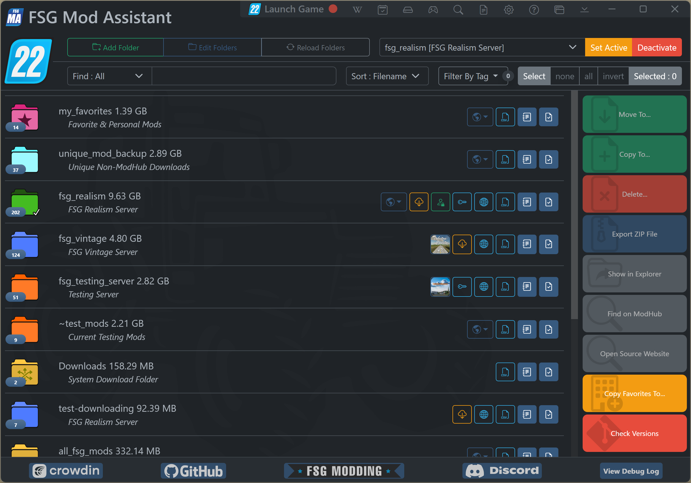

# FSG Mod Assistant - Main Interface

[← Back to main](index.html)

This is what Mod Assistant looks like.  Below, the 5 main areas are broken down with links to more information.

## Menu Bar

This area contains functions that tend to apply everywhere, grouped to take up as little space as possible.

On the top line, you'll see the application title (drag to move the window), a game launch button, and the title bar buttons.

From left to right, those buttons are:

- __Launch Game :__ Launch Farming Simulator
- <i class="bi bi-wikipedia"></i> : [Browse Base Game Vehicles, Implements, Objects, and Placeables](basegame.html)
- <i class="bi bi-calendar2-check"></i> : [Savegame Mod Tracking](savetrack.html)
- <i class="bi bi-hdd"></i> : [Local Savegame Manager](savemange.html)
- <i class="bi bi-controller"></i> : [Manage inputBindings.xml](input.html)
- <i class="bi bi-search"></i> : [Search All Collections](search.html)
- <i class="bi bi-file-earmark-text"></i> : [Game Log Viewer](gamelog.html)
- <i class="bi bi-gear"></i> :  [User Preferences](preferences.html)
- <i class="bi bi-question-circle"></i> : Quick Link to this Help Document
- <i class="bi bi-window-stack"></i> : Toggle Mini-Mode Button
- <i class="bi bi-chevron-bar-down"></i> : Minimize app to taskbar
- Standard Minimize, Maximize, and Close

## Collection Management

Next line down, you will find the 3 folder buttons and the 3 collection controls which form the [Collection Management](collections.html) section.

## Mod List Filtering

The last line in this section contains some selection buttons and the [Filter Tools](filter.html)

## Collection Area

The collection area is the main interface of Mod Assistant.

From here, you can easily launch or perform the functions detailed in:

- [Collection Area](mods.html)
- [Collection Details Window](details.html)
- [Savegame Compare](savegame.html)
- [Detail Window](moddetail.html)

## Sidebar Area

This area contains functions for working directly with mods.

Among those functions are:

- [Import and Export](importexport.html)
- [Move, Copy, Delete, and Copy Favorites](fileoper.html)
- Show in Explorer (System File Explorer)
- Find on ModHub (opens in default web browser)
- Open Source Website (opens in default web browser)
- The [Version Check](versions.html) tool.
