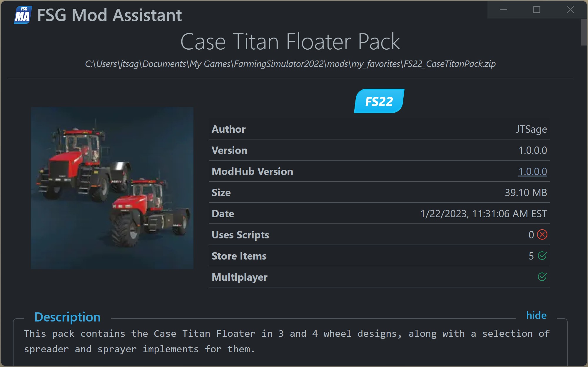
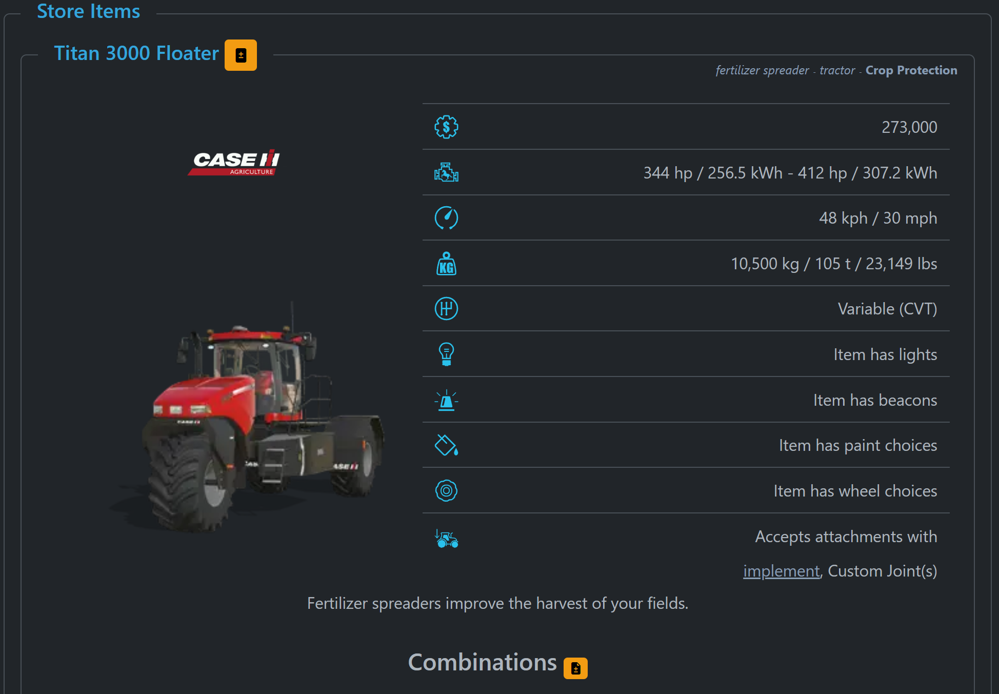
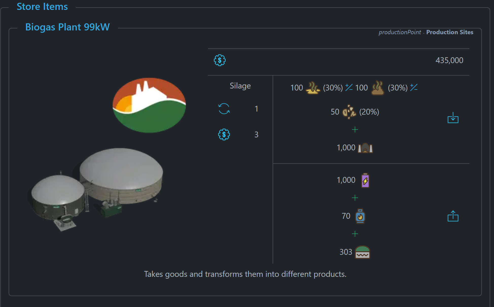
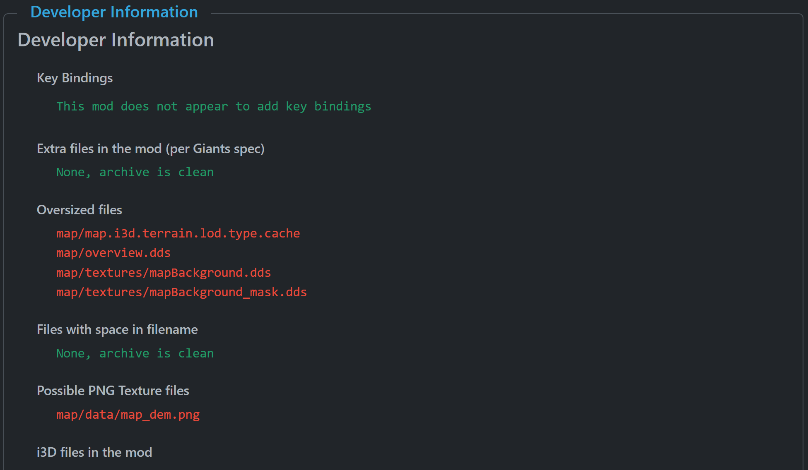

# FSG Mod Assistant - Mod Detail

[← Back to main](index.html)

## Overview

The mod detail screen provides detailed information about each mod

In the top section, you will find the mod Title, Author, current version, current modhub version (if applicable), size, file data, and if the mod uses scripts, has store items, or is multiplayer safe. Also supplied is the modder configured description information

## Map Mods

For maps, the crop calendar will be shown that would apply to the map. Also show, if it can be successfully loaded, is the map overview.

## Store Items

For mods that include store items, those items will be shown

### Vehicles & Implements

Each vehicle or implement will be shown, along with store combinations if defined, and a graph is applicable.  The orange buttons will add that item to the [comparison tool](comparetool.html) screen.

### Placeables

For placeables, similar information is shown, including production recipes where applicable.

## Dependencies

This section will list what other mods must be present for this mod to function, if there are any

## Developer Information

The last section is various developer information.  Of interest to a wider audience, the default key bindings of the mod will be shown, if it adds any.  If the mod has conflicting default key bindings, they will appear above the description section.

