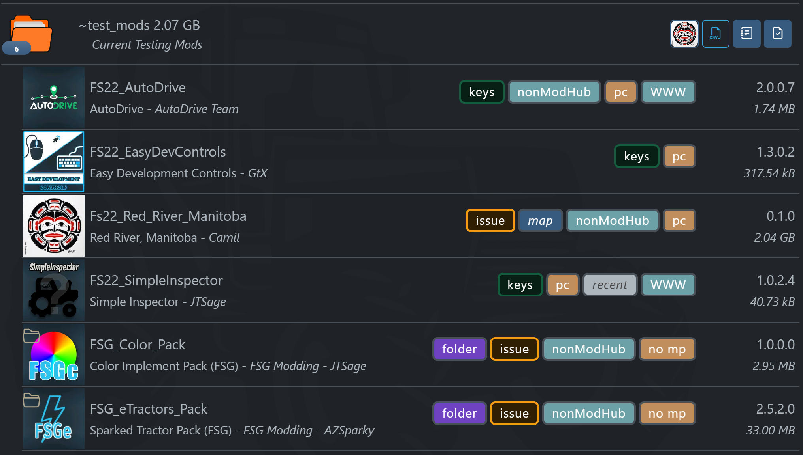
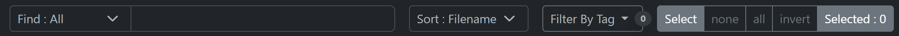

# FSG Mod Assistant - Collection Area

[← Back to main](index.html)

## Overview

The mod collection area is the main informational center of Mod Assistant.  Here you can view, select and process your mod collections.

### Mod Status

Mods are only marked unusable when Mod Assistant is reasonably certain that they will not function in game.  They look something like this - note the darker background.  In this case, it is a FS17 mod in a FS22 collection, and will not load in-game.

## Information Displayed

In this section you will see several data items:

- Context color - dark is broken, and green is selected.
- the "Short Name" of the mod, which is derived from the file name without the `.ZIP` extension
- The mod title
- The mod author
- The mod version
- The mod size
- Any number of status tags and badges

## The Tags (Badges)

- __Depend__ : This mod has un-met dependencies.
- __Keys__ : This mod contains added key bindings.  When green, these keybinds do not conflict with another mod in the collection.  When red, they appear to conflict (although, in some cases this is fine - but if you can't use a mod, this could provide a helpful clue as to why)
- __Update__ : The version of the mod you have does not match the version on modhub
- __New__ : This file has been added to this collection since the last scan
- __Recent__ : This mod has recently been updated or released on the modHub
- __nonModHub__ : This mod wasn't found on ModHub, it is probably a 3rd party mod.
- __NotMOD__ : This file is not a mod
- __Broken__ : This mod is likely broken
- __Issue__ : This mod may have non game breaking issues
- __noMP__ : This mod can't be used for multiplayer
- __Folder__ : This mod is unzipped
- __PC__ : This mod contains scripts, and will only work on PC/Mac.  Once in a while a modder may leave an extra script in a crossplay mod, but Mod Assistant is unable to detect if this is the case.

__Special Note:__ - The Issue badge is based on all the possible issues we know about, _including_ those that the Giants Server software reports - some of those issues are easily ignorable, and in fact do not pose a problem to a mod being included on the modhub.  However, for completeness, they are displayed by Mod Assistant.

## Selecting Items and Mouse Actions

There are quick selection buttons on the right side of the interface.  The number in white is the number of mods currently selected. Not that None/All/Invert work on the mods currently in view - they will respect searches and filters.

### Keyboard Shortcuts

- `CTRL`+`A` Select All
- `CTRL`+`SHIFT`+`A` Select None
- `CTRL`+`I` Select Inverse

### Primary Button

- `LEFT CLICK` a mods to select it

- `LEFT CLICK` a mod, then `SHIFT`+`LEFT CLICK` a second mod to select a range

- `LEFT CLICK`(x2) a mod to open it's details page

- `ALT`+`LEFT CLICK` a mod to set that mod as the "active" one for the `Open in Explorer` and `Find on ModHub` interface buttons

### Secondary Button

- `RIGHT CLICK` a mod will to display a context menu where you can carry out most operations on that single mod

The only feature _only_ accessible with right click is `Set Source Website` which allows you to assign a source website to a mod when it is not from ModHub.

