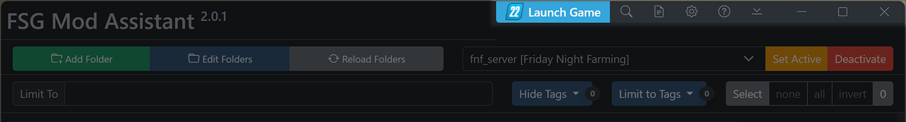

# FSG Mod Assistant - Multiple Version Mode

[← Back to main](index.html)

___COMING SOON:__ This page includes information about a feature currently being built - many of the items mentioned on this page do not yet exist in the app_

Mod Assistant can be used with other versions of Farming Simulator - but this behavior is opt-in for a better first user experience

## Turning it On

To turn on multiple version mode, head to the preferences editor, located on the top bar - it's the `Gear` icon.

Then, set `Multiple Game Version Mode` to on

## Setting Game Launch and gameSettings.xml Paths

For this to work, you will need to turn on the versions of the game you wish to use, and set the game launch path and gameSettings.xml path for each.

## Changing Game Version

To change the game version, use the dropdown beside the collection bar in the main interface.

## Setting Collection Versions

To set a collection to a specific game version, you can do 2 things

- Add that collection while in the correct version mode
- Edit the collection details and specify the game version

To edit a collection, hit the collection details button next to the `Savegame Compare` button

Then, set the game version as stated.  Note that in single version mode, this setting is ignored

