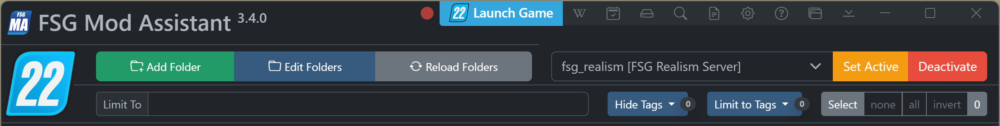
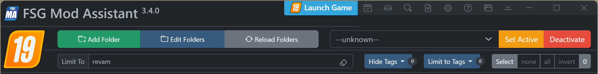
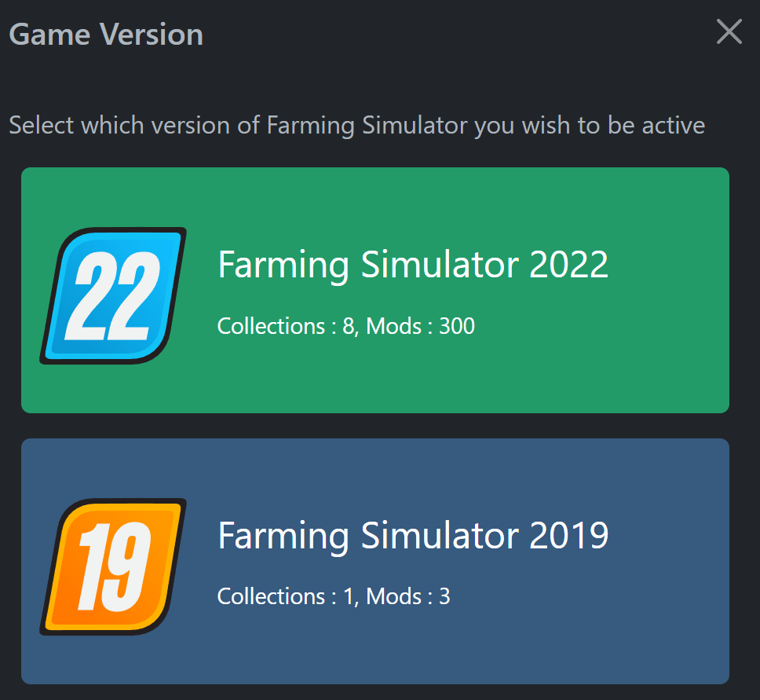

# FSG Mod Assistant - Multiple Version Mode

[← Back to main](index.html)

Mod Assistant can be used with other versions of Farming Simulator - but this behavior is opt-in for a better first user experience

## Turning it On

To turn on multiple version mode, head to the preferences editor, located on the top bar - it's the <i class="bi bi-gear"></i> icon.

Then, set `Multiple Game Version Mode` to on

## Setting Game Launch and gameSettings.xml Paths

For this to work, you will need to turn on the versions of the game you wish to use.  Use the button directly below the FS icon for that version to toggle.

Then set the game launch path, gameSettings.xml path and any command line arguments for for each.

## Interface Changes

You will notice some additions to the main interface.  The current game mode is reflected in the title bar are with a `FS##` badge, the game icon is added to the collections / filter bar area, and the game icon on the launch button changes

To change the game version, click on the large game icon to bring up this menu

## Setting Collection Versions

To set a collection to a specific game version, you can do 2 things

- Add that collection while in the correct version mode
- Edit the collection details and specify the game version

To edit a collection, hit the collection details button next to the `Savegame Compare` button

Then, set the game version as stated.  Note that in single version mode, this setting is ignored

