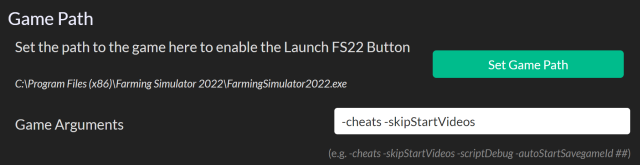
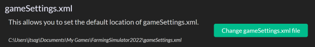
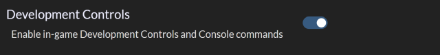
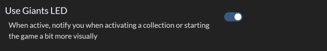
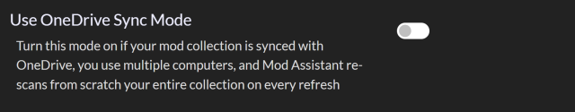
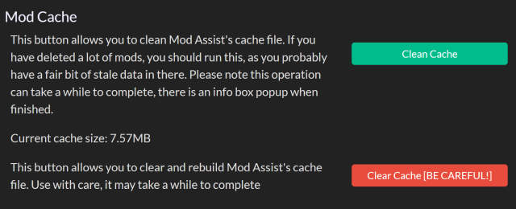
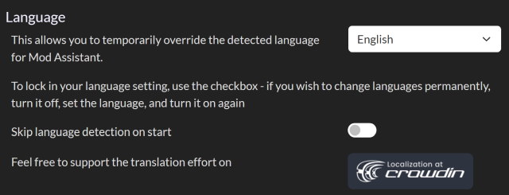

# FSG Mod Assistant - Preferences Window

[← Back to main](index.html)

## Options

### Game Path

This sets the path to the game program in order to use the launch button.  In most cases, this will set itself correctly.  The game program is named `FarmingSimulator2022.exe`

You can also set additional arguments to the game here - note that if you have the steam version, you'll need to use those *same* arguments in steam, or it Steam will ask you if you are sure on every launch.

Popular arguments are `-cheats` and `-skipStartVideos`.  Note that the autoStart argument may disable log file overwriting and cause your log file to grow to extreme sizes.

### gameSettings.xml

This is the path to your gameSettings.xml file, located one folder up from where the default mod folder is. Mod Assistant needs this to set the current collection and any collection details you define.

### Development Controls

This enables the in-game development controls, also known as console commands.

### Giants LED

If you purchased the collectors edition, or the Giants LED beacon light separately, this will enable Mod Assistant to use it for some visual feedback.

### Use OneDrive Sync Mode

In some cases, if you synchronize your mods with multiple computers, Mod Assistant will think they have all changed every time it re-scans your folders.  This option will use a different method of keeping track which may help.

### Mod Cache

The Mod Cache is how Mod Assistant is able to keep track of your mod files.  If you have removed a lot of mod files over time, it may be a good idea to `Clean Cache`, or, when upgrading between major versions, `Clear Cache` can help. In the example image, my mod collection is around 500 files, and this was after rebuilding the cache after the 2.0.0 upgrade.

### Language

This section is for setting the language that Mod Assistant appears in.  In most cases, it will guess correctly, but if you wish to choose a new one, you can do so here.  The Lock function will stop Mod Assistant from guessing your language permanently, and use the one selected.  Make sure to set the lock *after* selecting your language.
