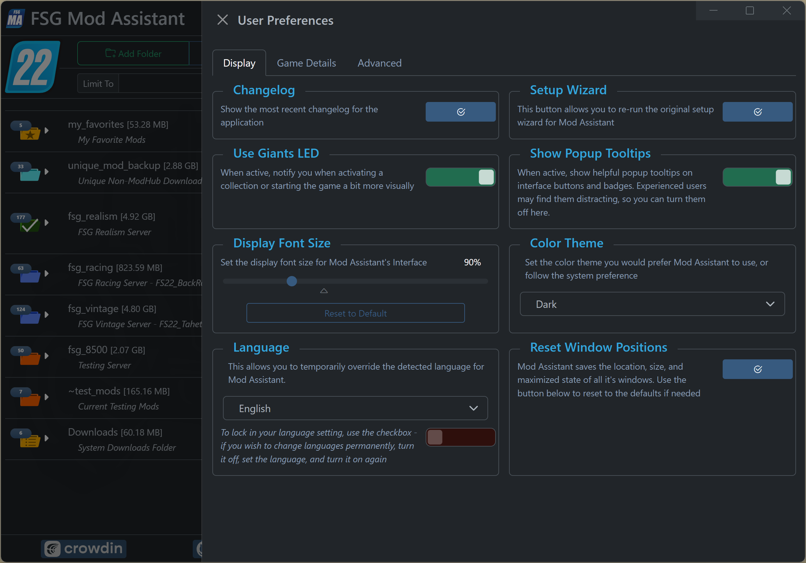
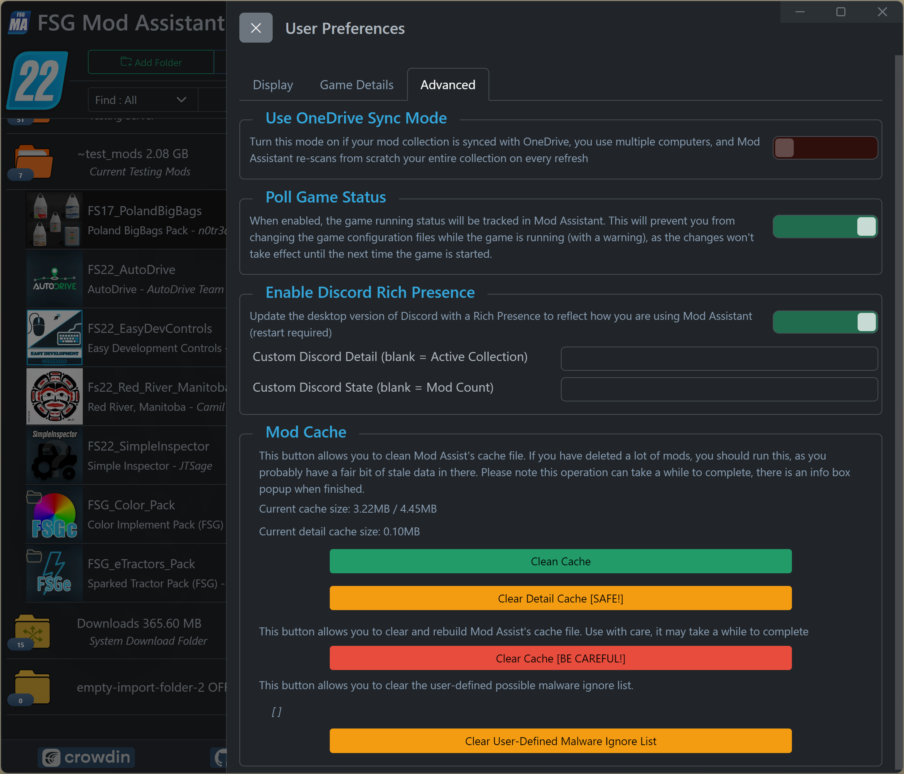

# FSG Mod Assistant - Preferences Window

[← Back to main](index.html)

## Opening Preferences

To edit your user preferences, click on the  <i class="bi bi-gear"></i> icon located in the top bar of the main interface. As of version 3.5.0, preferences are included in the main window.

## Display Options

### Changelog

The changelog window is the popup when first starting a new version of Mod Assistant.  Hit this button to read it again.

### Setup Wizard

Re-open and re-run all or part of the [setup wizard](wizard.html)

### Giants LED

If you purchased the collectors edition, or the Giants LED beacon light separately, this will enable Mod Assistant to use it for some visual feedback.

### Tooltips

If for some reason you prefer to not see mouseover (hover) tooltips, you can turn them off here.

### Font Size

You can set your preferred font size scale here - the UI will do it's best to scale as well based on this.

### Color Theme

Mod Assistant has a light and dark mode, you can set that here.  Options are `Light`, `Dark` (default), and `Follow System Setting` which will follow your choice in windows

### Language

This section is for setting the language that Mod Assistant appears in.  In most cases, it will guess correctly, but if you wish to choose a new one, you can do so here.  The Lock function will stop Mod Assistant from guessing your language permanently, and use the one selected.  Make sure to set the lock *after* selecting your language.

### Window Size & Position

Sometimes, your windows may get to be odd sizes, or open in odd places.  These settings are saved, so you can fix it per window, or, if you prefer, reset them all to default here.

## Game Options

### Multiple Version Mode

Mod Assistant is capable of working with more than one version of Farming Simulator at the same time.  We currently support `FS22`, `FS19`, `FS17`, `FS15`, and `FS13`.  At this time, there are no plans to support earlier versions, nor will any attempt be made at supporting any mobile version.  You can learn more about this feature in the [Multiple Game Version Mode](multi-version.html) documentation.

### Game Path Settings

All of the game settings are grouped by version for easier reading.

##### gameSettings.xml

- This is the path to your gameSettings.xml file, located one folder up from where the default mod folder is. Mod Assistant needs this to set the current collection and any collection details you define.

##### Game Path and arguments

- This sets the path to the game program in order to use the launch button.  In most cases, this will set itself correctly.  The game program is named `FarmingSimulator2022.exe`
- You can also set additional arguments to the game here - note that if you have the steam version, you'll need to use those *same* arguments in steam, or it Steam will ask you if you are sure on every launch.
- Popular arguments are `-cheats` and `-skipStartVideos`.  Note that the autoStart argument may disable log file overwriting and cause your log file to grow to extreme sizes.

##### Development Controls

- This enables the in-game development controls, also known as console commands.

## Advanced Options

### Use OneDrive Sync Mode

In some cases, if you synchronize your mods with multiple computers, Mod Assistant will think they have all changed every time it re-scans your folders.  This option will use a different method of keeping track which may help. It is generally safe to enable this, only full-time mod developers may find small issues with things not updating.

### Poll Game Status

When enabled, this will update the Mod Assistant interface to indicate if the game is currently running.  This is only applicable to Farming Simulator 22

### Discord Rich Presence

If you'd like Mod Assistant to update your discord presence (desktop app only), you can set that up here. You can also set 2 custom status lines here. This is on by default.

### Mod Cache

The Mod Cache is how Mod Assistant is able to keep track of your mod files.  If you have removed a lot of mod files over time, it may be a good idea to `Clean Cache`, or, when upgrading between major versions, `Clear Cache` can help. In the example image, my mod collection is around 500 files, and this was after rebuilding the cache after the 2.0.0 upgrade. The `Clear Detail Cache` is a safe option if you have altered a mod and the store data is out-of-date. Note that the detail cache auto-expires over time.
