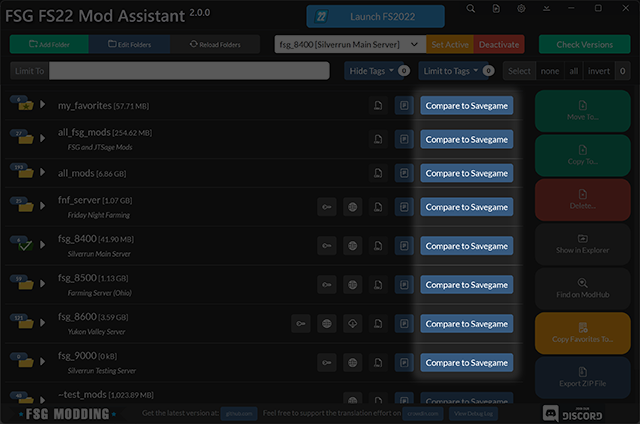
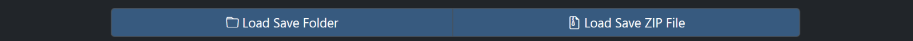
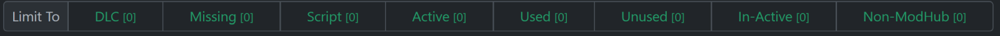
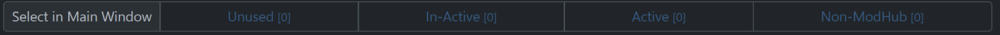
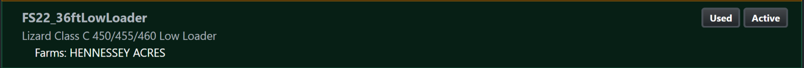
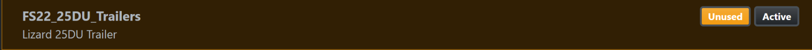
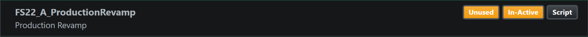
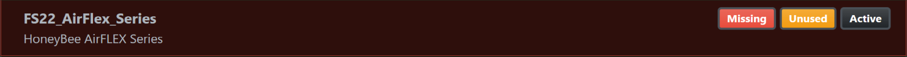

# FSG Mod Assistant - Savegame Compare

[← Back to main](index.html)

## Opening the tool

The tool for comparing a savegame to a collection is located to the left of each collection.

Additionally, if a ZIP savegame is detected in an added collection (for instance your downloads), you can right click it and compare it against any collection.

## Loading a savegame

To load a savegame, you have 2 options

- Load a folder directly
- Load a ZIP file, like you would download from a server

## Filtering Results

You can filter the results of opening a file by the badges they are given

The badge meanings are as follows:

- **DLC** : DLC Content
- **Missing** : File does not exist in the collection
- **Script** : Mod contains scripts that add or change game functions
- **Active** : Mod is active in the savegame (selected in the choose mods screens prior to load)
- **Used** : Something from the mod has been purchased and exists in-game
- **Unused** : Nothing from the mod appears to have been purchased in game.  See also the note above.
- **In-Active** : This mod is not loaded with the savegame
- **Non-ModHub** : This mod does not appear on the in-game modhub.

## Select Mods

Often, it is useful to select a subset of this collection's mods in the main window based on the results of the savegame scan

You can select:

- **Unused** : Mods that are not loaded by the savegame
- **In-Active** : Mods that are loaded by the savegame, but appear unused
- **Active** : Mods that are active in the savegame
- **Non-ModHub** : Mods that are not on the in-game modhub. Particularly useful for exporting a set of mods to send to a friend.

## Example Results

There are multiple context colors used in the resulting display.

- **Green** - Used, active mods
- **Yellow** - Active but unused mod
  - Could be removed, but take care - a mod that only adds scripts or consumables (seed, bales, etc) may incorrectly show as "Unused"
- **Grey** - Unused, Inactive mod
  - Maybe just taking up space
- **Red** - Used, active mods that are ***missing*** from the collection

  

