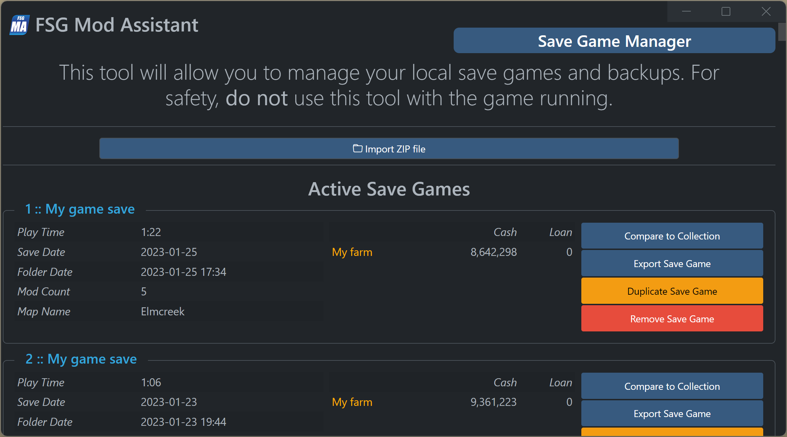
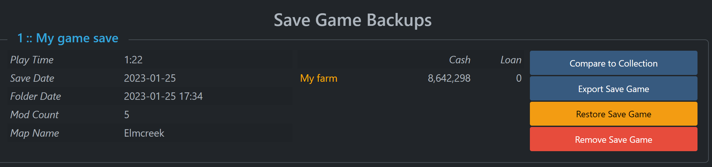

# FSG Mod Assistant - Local Save Game Manager

[← Back to main](index.html)

## Overview

The Local Save Game Manager tool lets you manage the save games on your local system. Open it with the <i class="bi bi-hdd"></i> icon in the top bar

## Active Save Games

From this screen you can import a downloaded save game, duplicate a save to another slot, export to ZIP file, compare it to a collection, or remove it completly.  Note that for the functions on this page, there is no **UNDO** - a good idea is to export any important saves to ZIP before you start moving things around

## Backup Save Games

The lower portion of this screen lets you access local save game backups in much the same way, in addition to restoring them to the same or a differnt slot.  Again, these are overwriting operations, and there is no undo.
