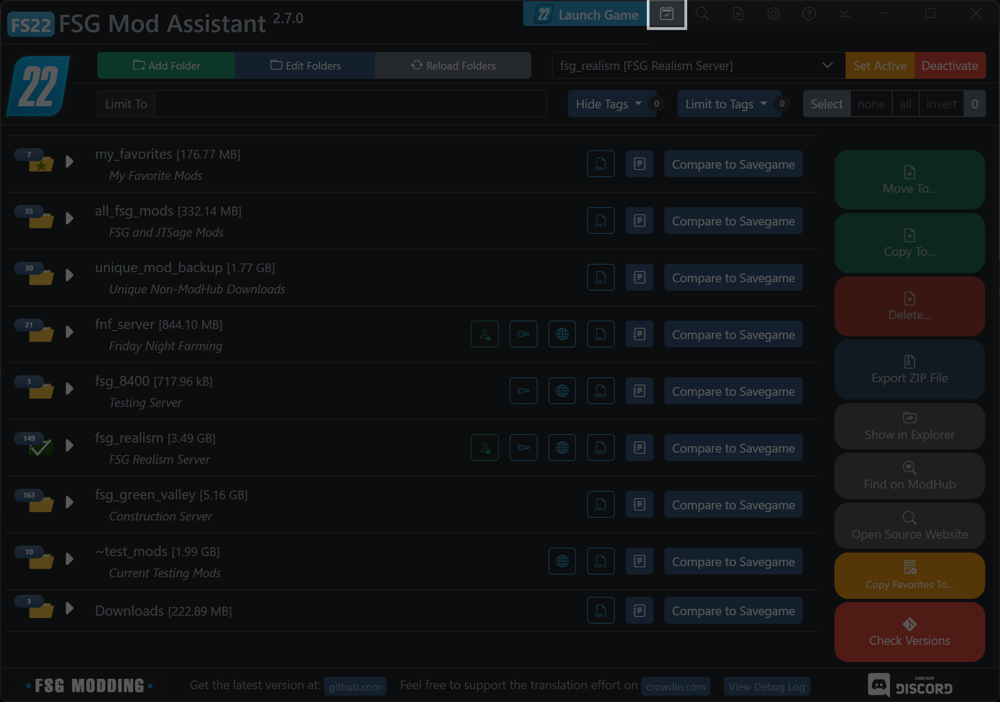
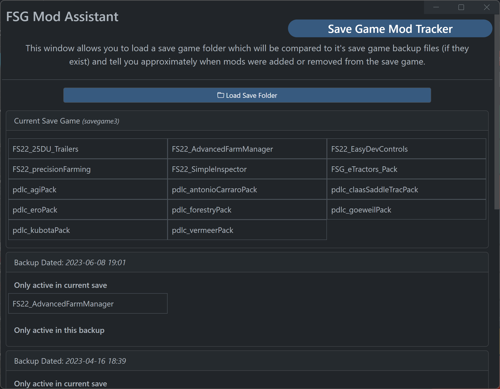

# FSG Mod Assistant - Savegame Mod Tracker

[← Back to main](index.html)

## Opening the tool

The tool for comparing a savegame to a collection is located in the top set of buttons in the main interface

## Using the tool

Load a savegame using the button.  Only local save folders are supported for this tool.  If backup saves exist, and they use the same map, you will be shown the differences in the mod sets

