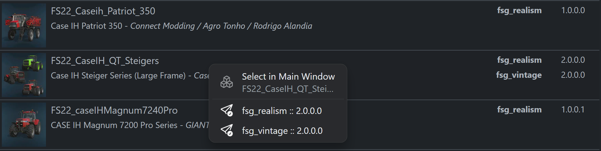

# FSG Mod Assistant - Search All Collections

[← Back to main](index.html)

## Overview

Often times you may know you have a specific mod but are unsure where it might be.  The find all feature can help.  It is activated with the spy glass button in the title bar at the upper left, directly next to the launch button

## Find All Display

The filter input works the same way here as it does in the main collection interface.  Search mod names, title and authors with a full text search.  Start your search with an exclamation mark `!` to find mods the do **not** meet the criteria

## Select in Main

When you have found what you are looking for, right click on the mod row and you will be presented with a context menu of clickable collections that have that mod in them.  Clicking one will select only that mod in the main interface display.

