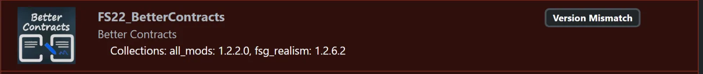

# FSG Mod Assistant - Version Check

[← Back to main](index.html)

## Opening the tool

The tool for checking versions across collections is located as the last item in the side bar

## Matching Version

When a mod exists in multiple collections, but all of those collections have the same version of the file, a match record will be displayed.

In this example, this mod appears in 5 collections.

## Non-Matching Version

If a mod exists in multiple collections, but it is not the same in each, a mismatch record will appear.

In this example, the version of the mod in my `fsg_8660` collection is an older version

## Synchronizing Versions

In some cases, different versions of mods in different collections is intended.  It's part of the reason we created Mod Assistant, so if a multiplayer server is slow to update, you can use the latest version other places, and not get locked out of the server down the line.

However, if you want to synchronize some or all of the files, double click on the mismatch to bring up the resolve differences window.

In this window, fill the checkmark next to the collection or collections you would like to update, and hit the `Yes, Copy Mod(s)` button to proceed. Keep in mind, this will overwrite the old file.

If you wish to quickly select all collections to update, you can press `CTRL+A`.  Likewise, `CTRL+SHIFT+A` will select no collections.
