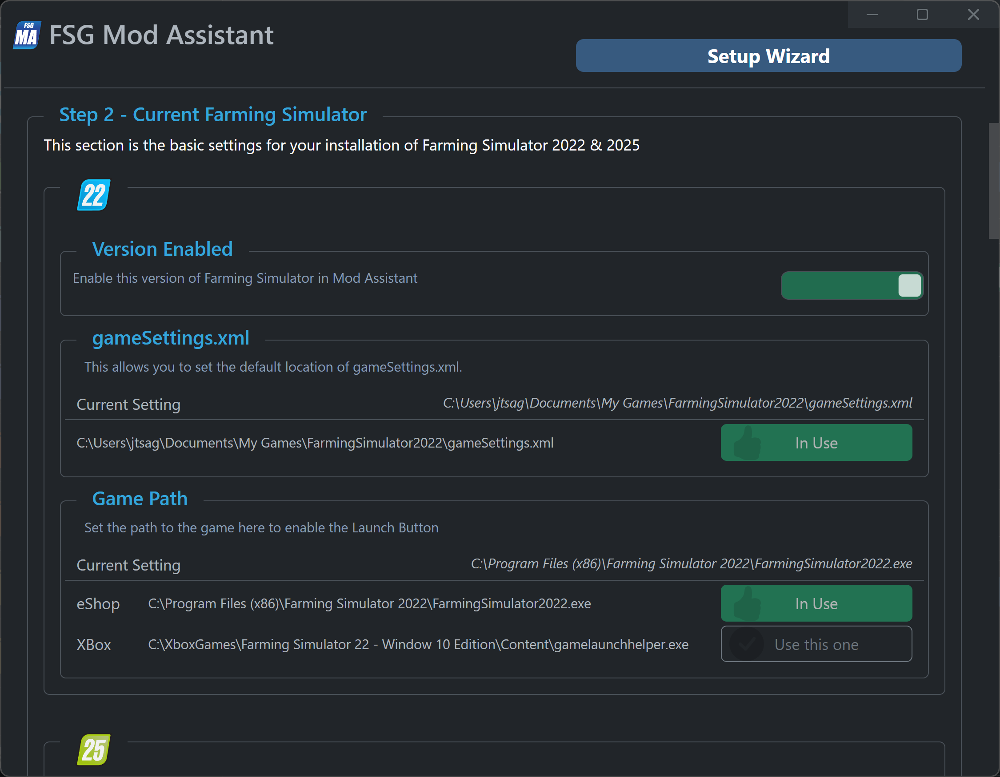
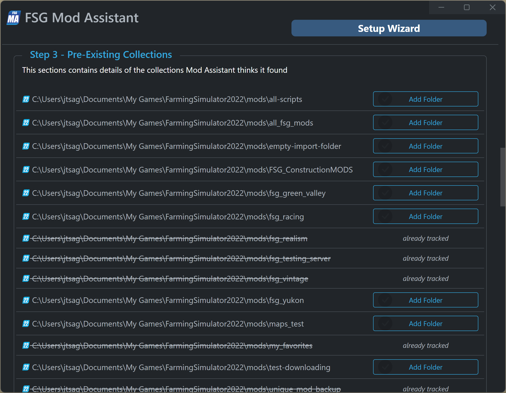

# FSG Mod Assistant - Setup Wizard

[← Back to main](index.html)

This tool exists for first time users of Mod Assistant to get going fast.  If you want, you can re-run it at any time from the preferences menu.

## Step 1

The first step is for the simple things - it lets you set the display font size, color theme, tooltip preference, and your language - if you had to change your language when this screen appeared, it's a good idea to hit the switch box under the chooser after you select the right one.

## Step 2

Next, we need some basic details about where Farming Simulator 2022 and/or 2025 is installed.  Mod Assistant will do it's best to find your settings file and game exe.

If you see an option that looks good, and the button isn't already green with a thumbs up, go ahead and press it.

Mod Assistant can find Farm Sim in the default eShop install, the default Epic Games install, any steam folder, and the default MS/XBox store install location.  If it fails, you'll need to locate the game manually.

If more than one install is found, they will all be presented as options.

## Step 3

A lot of new users of Mod Assistant are already using mod collections, they are just doing it the hard way.  In step 3, if MA sees a bunch of `.ZIP` files in your mods folder, it will offer to add it as a collection.  If it sees a bunch of folders in there that __do not__ start with `FS`, it will offer to add those as collections.  New in 5.0.0, it will search for previous version mod folders as well - the version mod assistant things a collection for is denoted by the icon at the beginning of the line

## Step 4

Some users want to manage more than one version of Farming Simulator.  Toggle the switch to set each up.  FS19, 17, 15, & 13 are supported. Some features of Mod Assistant don't work with prior versions of Farming Simulator. (most things work with FS19, less with even earlier)

## Step 5

Congratulations, you are done.  And since you are reading this text, you even clicked on the link maybe?  Thanks!

